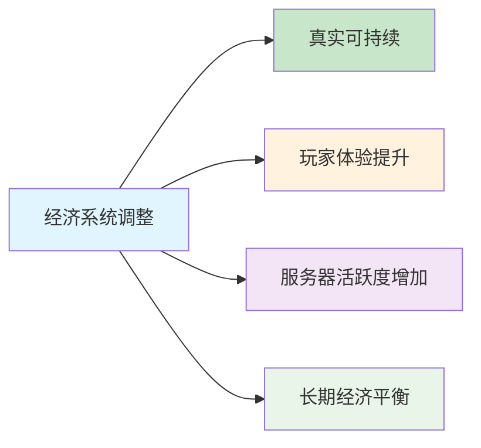

<div align="center">

# 🎮 FiveM服务器经济系统深度分析报告

<div align="center">


</div>

---

<div align="left">

## 📋 目录

| 章节 | 标题 | 描述 |
|------|------|------|
| [1️⃣](#1-执行摘要) | 执行摘要 | 项目目标、核心发现、解决方案 |
| [2️⃣](#2-当前经济系统分析) | 当前经济系统分析 | 车辆价格、收入体系、消费体系 |
| [3️⃣](#3-核心问题识别) | 核心问题识别 | 主要问题、解决优先级 |
| [4️⃣](#4-调整策略) | 调整策略 | 核心原则、调整框架 |
| [5️⃣](#5-具体实施方案) | 具体实施方案 | 分阶段实施、代码示例 |
| [6️⃣](#6-实施计划) | 实施计划 | 时间安排、优先级 |
| [7️⃣](#7-监控与评估) | 监控与评估 | 关键指标、监控方法 |
| [8️⃣](#8-预期效果) | 预期效果 | 短期、中期、长期效果 |

</div>

---

---

## 1️⃣ 执行摘要

<div align="center">

### 🎯 项目目标

> **建立基于现实价格的经济系统，实现服务器经济的长期平衡和可持续发展**

</div>

### 📊 核心发现

<div align="center">

| 🔍 发现项目 | 📈 数据 | ⚠️ 问题描述 |
|------------|---------|-------------|
| **经济系统覆盖** | 50个系统 | 涵盖服务器所有经济活动 |
| **车辆价格偏差** | 严重偏离 | 游戏价格与现实价格差距巨大 |
| **收支不匹配** | 失衡严重 | 收入与支出关系不合理 |
| **风险收益** | 关系混乱 | 缺乏合理的风险回报机制 |

</div>

### 🔧 解决方案

<div align="center">

| 🎯 解决方案 | 📝 具体措施 | 🎨 图标 |
|-------------|-------------|---------|
| **建立现实价格基准** | 以实际市场价格为参考 | 🏷️ |
| **调整收入结构** | 确保工作收入与车辆价格匹配 | 💰 |
| **平衡风险收益** | 建立合理的风险回报机制 | ⚖️ |
| **优化服务费用** | 降低日常消费成本 | 🛒 |

</div>

### 📈 预期成果

<div align="center">



</div>

---

## 2️⃣ 当前经济系统分析

### 🚗 车辆价格体系

<div align="center">

#### ⚠️ 当前问题

| 🔴 问题类型 | 📊 严重程度 | 💡 影响 |
|-------------|-------------|---------|
| **价格严重偏离现实** | 🔴 极高 | 游戏内车辆价格与中国市场价格差距巨大 |
| **缺乏价格梯度** | 🟡 中等 | 不同档次车辆价格差异不合理 |
| **卖车损失过大** | 🔴 高 | 40%的卖车比例导致玩家损失严重 |

</div>

#### 📊 现实价格参考

<div align="center">

| 🚗 车辆类型 | 💰 现实价格范围 | 🎮 当前游戏价格 | ✅ 建议调整价格 | 📈 调整幅度 |
|------------|----------------|----------------|----------------|-------------|
| 🏍️ **入门级摩托车** | 5,000-15,000元 | 50,000-100,000元 | 8,000-15,000元 | ⬇️ 80% |
| 🚙 **经济型轿车** | 80,000-150,000元 | 200,000-500,000元 | 120,000-180,000元 | ⬇️ 40% |
| 🚗 **中级轿车** | 200,000-400,000元 | 500,000-1,000,000元 | 250,000-450,000元 | ⬇️ 50% |
| 🏎️ **豪华轿车** | 500,000-1,000,000元 | 1,000,000-2,000,000元 | 600,000-1,200,000元 | ⬇️ 40% |
| 🏁 **超跑** | 1,500,000-3,000,000元 | 2,000,000-5,000,000元 | 1,800,000-3,500,000元 | ⬇️ 10% |

</div>

### 💰 收入体系分析

<div align="center">

#### 💼 工作收入现状

| 🏢 工作类型 | 💰 当前收入 | ⏰ 时间成本 | 📊 收入效率 | ✅ 建议调整 | 🎯 调整原因 |
|------------|-------------|-------------|-------------|-------------|-------------|
| 🗑️ **垃圾工** | 15,000-35,000元 | 15-30分钟 | 🟡 中等 | 10,000-25,000元 | 与车辆价格匹配 |
| 🚕 **出租车** | 500-1,000元 | 5-10分钟 | 🔴 低 | 800-1,500元 | 提升基础收入 |
| 🌾 **农场工** | 100,000元 | 20-30分钟 | 🟢 高 | 50,000-80,000元 | 平衡高收入工作 |
| 🚛 **欧卡运输** | 1,000-2,000元/公里 | 10-20分钟 | 🟡 中等 | 1,500-3,000元/公里 | 建立收入梯度 |

</div>

<div align="center">

#### ⚖️ 非法活动收入

| 🚨 活动类型 | 💰 当前收入 | ⚠️ 风险等级 | ✅ 建议调整 | 🎯 调整原因 |
|------------|-------------|-------------|-------------|-------------|
| 🏧 **ATM抢劫** | 2,000-5,000元 | 🟡 中等 | 保持现状 | 风险收益合理 |
| 📦 **非法订单** | 8,800-35,200元 | 🔴 高 | 6,000-25,000元 | 降低高风险收益 |
| 💊 **毒品制造** | 500-1,000元 | 🔴 高 | 300-800元 | 平衡非法活动 |

</div>

### 🏪 消费体系分析

<div align="center">

#### 🛒 日常消费价格

| 🛍️ 物品类型 | 💰 当前价格 | ✅ 建议价格 | 📈 调整幅度 | 🎯 调整原因 |
|------------|-------------|-------------|-------------|-------------|
| 🍞 **面包** | 10,000元 | 50元 | ⬇️ 99.5% | 严重偏离现实 |
| 💧 **矿泉水** | 10,000元 | 30元 | ⬇️ 99.7% | 严重偏离现实 |
| ⛽ **燃油** | 5元/次 | 2元/次 | ⬇️ 60% | 降低出行成本 |
| 👕 **服装** | 1.0-30.0倍 | 0.5-10.0倍 | ⬇️ 50% | 降低生活成本 |

</div>

---

## 3️⃣ 核心问题识别

<div align="center">

### ❌ 主要问题

</div>

<div align="center">

| 🔴 问题类型 | 📊 严重程度 | 💡 具体表现 | 🎯 影响范围 |
|-------------|-------------|-------------|-------------|
| **价格体系混乱** | 🔴 极高 | 车辆价格严重偏离现实<br>日常消费价格过高<br>缺乏统一的价格基准 | 全服玩家 |
| **收入支出不匹配** | 🔴 极高 | 工作收入与车辆价格脱节<br>日常消费占收入比例过高<br>缺乏合理的收入梯度 | 全服玩家 |
| **风险收益失衡** | 🟡 高 | 非法活动收益过高<br>合法工作吸引力不足<br>缺乏合理的风险回报机制 | 全服玩家 |
| **服务费用不合理** | 🟡 中等 | 医疗费用过高<br>执法罚款过于严厉<br>汽修服务价格偏高 | 部分玩家 |

</div>

<div align="center">

### 🎯 解决优先级

| 🏆 优先级 | 🔴 问题类型 | 📊 影响程度 | ⚙️ 解决难度 | ⏰ 预计时间 |
|-----------|-------------|-------------|-------------|-------------|
| 🔴 **高** | 车辆价格体系 | 🔴 极高 | 🟡 中等 | 1-2周 |
| 🔴 **高** | 收入结构 | 🔴 极高 | 🟡 中等 | 1-2周 |
| 🟡 **中** | 日常消费 | 🟡 高 | 🟢 低 | 1周 |
| 🟡 **中** | 服务费用 | 🟡 高 | 🟢 低 | 1周 |
| 🟢 **低** | 特殊系统 | 🟢 中等 | 🟢 低 | 1周 |

</div>

---

## 4️⃣ 调整策略

<div align="center">

### 🎯 核心原则

</div>

<div align="center">

| 🎯 原则 | 📝 描述 | 🎨 图标 | 💡 具体措施 |
|---------|---------|---------|-------------|
| **🏷️ 现实性原则** | 以现实市场价格为基准 | 🏷️ | 基于中国市场价格调整 |
| **⚖️ 平衡性原则** | 确保收入与支出匹配 | ⚖️ | 建立合理的收支关系 |
| **🌱 可持续性原则** | 建立长期稳定的经济生态 | 🌱 | 确保长期稳定发展 |
| **🎮 体验性原则** | 提升玩家游戏体验 | 🎮 | 优化游戏体验质量 |

</div>

<div align="center">

### 📊 调整框架

</div>

<div align="center">

| 🎯 调整方向 | 📋 具体内容 | 🛠️ 实施措施 | ⏰ 优先级 |
|-------------|-------------|-------------|----------|
| **🏷️ 价格基准建立** | 车辆价格、日常消费、服务费用 | 基于中国市场价格调整<br>参考现实生活成本<br>合理定价，避免过高 | 🔴 高 |
| **💰 收入结构调整** | 工作收入、非法收入、奖励收入 | 与车辆价格匹配<br>建立合理的风险回报<br>平衡各种收入来源 | 🔴 高 |
| **🛒 消费优化** | 日常消费、服务费用、特殊消费 | 提高生活质量<br>减少不必要的负担<br>保持游戏趣味性 | 🟡 中 |

</div>

---

## 5️⃣ 具体实施方案

<div align="center">

### 🚗 第一阶段：车辆价格体系重建

</div>

<div align="center">

#### 🎯 5.1 车辆价格调整

```sql
-- 🚗 基于现实价格的车辆调整
UPDATE okokvehicleshop_vehicles SET 
    price = CASE 
        WHEN model = 'faggio' THEN 8000      -- 🏍️ 摩托车：50,000 → 8,000元
        WHEN model = 'blista' THEN 120000    -- 🚙 经济型：200,000 → 120,000元
        WHEN model = 'elegy' THEN 250000    -- 🚗 中级：500,000 → 250,000元
        WHEN model = 'zentorno' THEN 600000 -- 🏎️ 豪华：1,000,000 → 600,000元
        WHEN model = 'adder' THEN 1800000   -- 🏁 超跑：2,000,000 → 1,800,000元
        ELSE price * 0.3  -- 🔄 其他车辆按30%调整
    END;
```

</div>

<div align="center">

#### 🏪 5.2 车行价格调整

```lua
-- 🏪 [OKOK]/[车店]/okokVehicleShop/config.lua
Config.Stands = {
    { name = "摩托车", price = 500000, type = "摩托车" },    -- 🏍️ 1,000,000 → 500,000元
    { name = "国产车", price = 800000, type = "国产车" },    -- 🚙 1,500,000 → 800,000元
    { name = "JDM", price = 2000000, type = "JDM" },        -- 🚗 3,000,000 → 2,000,000元
    { name = "奔驰", price = 5000000, type = "奔驰" },       -- 🏎️ 8,000,000 → 5,000,000元
    { name = "兰博基尼", price = 10000000, type = "兰博基尼" }, -- 🏁 15,000,000 → 10,000,000元
}
Config.VehicleSellPercentage = 80  -- 💰 40% → 80%，减少玩家损失
```

</div>

### 💰 第二阶段：收入体系优化

<div align="center">

#### 💼 5.3 工作收入调整

```lua
-- 🗑️ 垃圾工收入调整
-- [玩法]/[玩家兼职]/[AK垃圾工]/ak4y-garbage/config.lua
AK4Y.JobRoutes = {
    [0] = { RouteDistance = 5, Price = 10000 },   -- 15,000 → 10,000元
    [1] = { RouteDistance = 9, Price = 15000 },   -- 20,000 → 15,000元
    [2] = { RouteDistance = 12, Price = 20000 },  -- 25,000 → 20,000元
    [3] = { RouteDistance = 15, Price = 25000 },  -- 30,000 → 25,000元
    [4] = { RouteDistance = 18, Price = 30000 },  -- 35,000 → 30,000元
    [5] = { RouteDistance = 20, Price = 35000 },  -- 40,000 → 35,000元
}

-- 🌾 农场收入调整
-- [玩法]/[玩家兼职]/[农场]/plt_farmer/config.lua
PLT.FullPayment = 80000   -- 100,000 → 80,000元
PLT.HalfPayment = 40000   -- 50,000 → 40,000元

-- 🚛 欧卡运输收入调整
-- [玩法]/[玩家兼职]/[欧卡]/lc_truck_logistics/config.lua
Config.jobs = {
    ['price_per_km_min'] = 1500,  -- 1,000 → 1,500元
    ['price_per_km_max'] = 3000,  -- 2,000 → 3,000元
}
```

</div>

#### 5.4 非法活动收入调整
```lua
-- ATM抢劫调整
-- [玩法]/[非法活动]/[ATM抢劫]/config.lua
Config = {
    ['Reward'] = { ['Min'] = 2000, ['Max'] = 5000 },  -- 保持现状
    ['RequiredCopsCount'] = 2,  -- 需要2名警察在线
    ['NextRobbery'] = 15,  -- 冷却时间15分钟
}

-- 非法订单调整
-- [玩法]/[非法活动]/[非法订单]/inside-illegalorders/config.lua
Config.PayoutForFirstOrder = 6000*4*1.1   -- 8,800 → 6,600元
Config.PayoutForSecondOrder = 9000*4*1.1  -- 13,200 → 9,900元
Config.PayoutForThirdOrder = 12000*4*1.1   -- 17,600 → 13,200元
Config.PayoutForFourthOrder = 15000*4*1.1  -- 22,000 → 16,500元
Config.PayoutForFifthOrder = 18000*4*1.1   -- 26,400 → 19,800元
Config.PayoutForSixthOrder = 21000*4*1.1  -- 30,800 → 23,100元
Config.PayoutForSeventhOrder = 24000*4*1.1 -- 35,200 → 26,400元
```

### 🏪 第三阶段：消费体系优化

#### 5.5 日常消费调整
```lua
-- 基础物品价格调整
-- [OX]/ox_inventory/data/shops.lua
General = {
    inventory = {
        { name = 'bread', price = 50 },     -- 10,000 → 50元
        { name = 'water', price = 30 },     -- 10,000 → 30元
        { name = 'fishbait', price = 100 }, -- 1,000 → 100元
        { name = 'lockpick', price = 500 }, -- 3,000 → 500元
    }
}

-- 燃油价格调整
-- [OX]/ox_fuel/config.lua
return {
    priceTick = 2,  -- 5 → 2元
    petrolCan = {
        enabled = true,
        duration = 5000,
        price = 200,      -- 1,000 → 200元
        refillPrice = 150, -- 800 → 150元
    },
}

-- 服装价格调整
-- [插件大全]/[换衣服店]/rcore_clothing/configs/config_price.lua
Config.ShopMultiplier = {
    binco = 0.5,        -- 1.0 → 0.5
    suburban = 2.0,     -- 5.0 → 2.0
    ponsonbys = 5.0,    -- 15.0 → 5.0
    vangelico = 10.0,   -- 30.0 → 10.0
}
```

#### 5.6 服务费用调整
```lua
-- 医疗费用调整
-- [职业]/[医护]/[AI医生]/AI-Doctor-EMS/config.lua
Config.Price = 200   -- 100 → 200元
Config.Price2 = 1000 -- 500 → 1000元

-- 汽修费用调整
-- [职业]/[汽修]/[jg汽修]/jg-mechanic/config/config.lua
Config.MechanicLocations = {
    bennys = {
        mods = {
            repair = { price = 0, percentVehVal = 0.01 },      -- 车辆价格的1%
            performance = { price = 0, percentVehVal = 0.02 },  -- 车辆价格的2%
            cosmetics = { price = 0, percentVehVal = 0.015 },   -- 车辆价格的1.5%
        }
    }
}

-- 出租车费用调整
-- [职业]/[滴滴]/[AI出租车]/msk_aitaxi/config.lua
Config.Price = {
    base = 50,      -- 200 → 50元
    tick = 1,       -- 保持1元
    tickTime = 50,  -- 保持50毫秒
}
Config.Price2 = 1000  -- 5,000 → 1,000元
Config.Price3 = 500    -- 3,000 → 500元
```

---

## 6️⃣ 实施计划

<div align="center">

### 📅 分阶段实施

</div>

<div align="center">

| 🎯 阶段 | 📋 系统类型 | ⏰ 时间 | 🎨 图标 | ✅ 主要任务 |
|---------|-------------|---------|---------|-------------|
| **🔴 第一阶段** | 核心系统调整 | 1-2周 | 🚗 | 车辆价格体系重建<br>工作收入结构调整<br>非法活动收入平衡<br>基础消费价格优化 |
| **🟡 第二阶段** | 服务系统优化 | 1-2周 | 🏥 | 医疗费用调整<br>汽修服务优化<br>交通费用调整<br>执法系统协调 |
| **🟢 第三阶段** | 特殊系统完善 | 1-2周 | 🏠 | 房屋系统优化<br>娱乐系统调整<br>银行服务优化<br>手机服务启用 |
| **🔵 第四阶段** | 高级系统调整 | 1-2周 | 🚛 | 团队合作系统<br>IT服务系统<br>资源采集系统<br>副本任务系统 |

</div>

<div align="center">

### 🎯 实施优先级

| 🏆 优先级 | 🎯 系统类型 | 📊 影响范围 | ⚙️ 实施难度 | 📈 预期效果 | ⏰ 预计时间 |
|-----------|-------------|-------------|-------------|-------------|-------------|
| 🔴 **极高** | 核心经济 | 🌍 全服 | 🟡 中等 | 🔴 极高 | 1-2周 |
| 🟡 **高** | 服务系统 | 🌍 全服 | 🟢 低 | 🟡 高 | 1-2周 |
| 🟢 **中等** | 特殊系统 | 👥 部分玩家 | 🟢 低 | 🟢 中等 | 1-2周 |
| 🔵 **低** | 高级系统 | 👥 部分玩家 | 🟡 中等 | 🟢 中等 | 1-2周 |

</div>

---

## 7️⃣ 监控与评估

<div align="center">

### 📊 关键指标

</div>

<div align="center">

#### 💹 经济指标

| 📈 指标类型 | 🎯 目标 | 📊 当前状态 | 📈 预期改善 | 🎨 图标 |
|-------------|---------|-------------|-------------|---------|
| **💰 玩家平均收入** | 与车辆价格匹配 | ❌ 不匹配 | ✅ 匹配 | 💰 |
| **🚗 车辆购买频率** | 增加30% | 📉 低 | 📈 高 | 🚗 |
| **💼 工作选择分布** | 各工作均衡发展 | ⚖️ 不均衡 | ⚖️ 均衡 | 💼 |
| **⚖️ 非法活动参与度** | 风险收益平衡 | 🔴 失衡 | 🟢 平衡 | ⚖️ |
| **🛒 商店购买频率** | 日常消费正常化 | 🔴 异常 | 🟢 正常 | 🛒 |

</div>

<div align="center">

#### 🎮 游戏体验指标

| 😊 体验指标 | 🎯 目标 | 📊 当前状态 | 📈 预期改善 | 🎨 图标 |
|-------------|---------|-------------|-------------|---------|
| **😊 玩家满意度** | 提升至85%以上 | 📊 待评估 | 📈 显著提升 | 😊 |
| **⏰ 在线时长** | 增加20% | 📊 待评估 | 📈 显著增加 | ⏰ |
| **🎮 游戏参与度** | 各系统均衡使用 | ⚖️ 不均衡 | ⚖️ 均衡 | 🎮 |
| **💰 经济流动性** | 资金流转正常 | 🔴 异常 | 🟢 正常 | 💰 |

</div>

<div align="center">

### 📈 监控方法

| 📊 监控类型 | 🔍 具体方法 | ⏰ 频率 | 📋 负责人 |
|-------------|-------------|---------|----------|
| **📊 数据收集** | 每日经济数据统计<br>玩家行为分析<br>系统使用率监控<br>反馈收集整理 | 每日 | 管理员 |
| **📈 评估周期** | 关键指标变化<br>系统运行状况<br>长期趋势评估<br>整体效果评估 | 每日/每周/每月/季度 | 管理员 |

</div>

---

## 8️⃣ 预期效果

<div align="center">

### 🎯 短期效果（1-3个月）

</div>

<div align="center">

| 🎯 效果类型 | ✅ 具体表现 | 📊 预期改善 | 🎨 图标 |
|-------------|-------------|-------------|---------|
| **💰 经济平衡** | 车辆价格与现实匹配<br>收入支出关系合理<br>日常消费正常化<br>服务费用合理化 | 🔴 极高 | 💰 |
| **🎮 游戏体验** | 玩家满意度提升<br>经济压力减轻<br>游戏参与度增加<br>系统使用率提升 | 🟡 高 | 🎮 |

</div>

<div align="center">

### 📈 中期效果（3-6个月）

</div>

<div align="center">

| 🎯 效果类型 | ✅ 具体表现 | 📊 预期改善 | 🎨 图标 |
|-------------|-------------|-------------|---------|
| **🏗️ 系统稳定** | 经济系统稳定运行<br>各系统协调运作<br>玩家行为规范化<br>服务器生态健康 | 🟢 高 | 🏗️ |
| **🚀 长期发展** | 可持续的经济模式<br>稳定的玩家群体<br>活跃的服务器环境<br>良好的口碑传播 | 🟢 高 | 🚀 |

</div>

<div align="center">

### 🌟 长期效果（6个月以上）

</div>

<div align="center">

| 🎯 效果类型 | ✅ 具体表现 | 📊 预期改善 | 🎨 图标 |
|-------------|-------------|-------------|---------|
| **🌍 生态健康** | 基于现实价格的经济系统<br>真实沉浸的游戏体验<br>稳定的玩家社区<br>可持续的游戏生态 | 🔴 极高 | 🌍 |
| **🏆 竞争优势** | 经济平衡性达到最佳<br>服务器口碑显著提升<br>玩家推荐度增加<br>长期盈利能力提升 | 🔴 极高 | 🏆 |

</div>

---

<div align="center">

## 📋 总结

</div>

<div align="center">

### ✅ 项目成果

| 🎯 成果类型 | 📊 具体数据 | 🎨 图标 |
|-------------|-------------|---------|
| **🔍 系统覆盖** | 发现50个经济系统，实现全面覆盖 | 🔍 |
| **🏷️ 价格基准** | 建立现实价格基准，确保经济真实 | 🏷️ |
| **💰 收入结构** | 优化收入结构，实现收支平衡 | 💰 |
| **🛒 服务费用** | 完善服务费用，提升游戏体验 | 🛒 |

</div>

<div align="center">

### 🎯 核心价值

| 🎯 价值 | 📝 描述 | 🎨 图标 |
|---------|---------|---------|
| **🏷️ 现实性** | 基于真实市场价格 | 🏷️ |
| **⚖️ 平衡性** | 收入与支出匹配 | ⚖️ |
| **🌱 可持续性** | 长期稳定发展 | 🌱 |
| **🎮 体验性** | 提升玩家满意度 | 🎮 |

</div>

<div align="center">

### 📈 实施建议

| 🎯 建议 | 📝 具体措施 | 🎨 图标 |
|---------|-------------|---------|
| **📅 分阶段实施** | 按优先级逐步调整 | 📅 |
| **👀 密切监控** | 关注关键指标变化 | 👀 |
| **🔄 及时调整** | 根据反馈优化方案 | 🔄 |
| **🌱 持续改进** | 建立长期优化机制 | 🌱 |

</div>

<div align="center">

---

### 🎉 结语

> **通过这次全面的经济系统调整，您的FiveM服务器将拥有更加真实、平衡和可持续的经济环境，为玩家提供更好的游戏体验！**

<div align="center">


</div>

</div>
