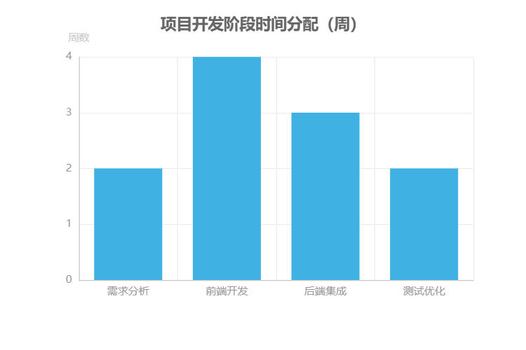

# 赛博朋克风FiveM服务器官网前后端开发详细策划案

## 项目概述

本项目旨在打造面向 GTA 玩家群体的赛博朋克风 FiveM 私人服务器官网，通过整合服务器介绍、游戏指南、文件下载、社区互动等核心功能，构建视觉吸引力强、用户体验优化的官方信息枢纽。项目基于 FiveM 私人服务器（GTA 多人联机模式）的游戏特性，以简化新玩家入门流程、提升用户留存率及建立高效内容管理机制为核心目标，为玩家提供沉浸式的赛博朋克数字体验。

### 技术架构与开发栈

项目前端采用 **Vue 3 + Pinia + Vue Router 4 + Element Plus** 技术栈，通过深度定制 Element Plus 主题实现赛博朋克风格的视觉呈现。技术架构以组件化开发为核心，结合 Pinia 进行状态管理，Vue Router 4 实现页面路由控制，确保复杂页面交互的流畅性与数据一致性。后端将聚焦于内容管理（如游戏指南 MD 文件存储、用户数据管理）与权限验证，通过 API 接口与前端实现数据交互，形成“前端负责视觉渲染与用户交互，后端处理业务逻辑与数据持久化”的清晰职责划分。

### 设计风格规范

项目整体采用**赛博朋克非扁平化设计风格**，以深色背景与霓虹元素构建未来科技感视觉体系：

- **色彩系统**：主色调为深蓝/紫色调背景（十六进制色值 `0a0a1a`），搭配霓虹青（`00FFFF`）作为强调色，形成高对比度的视觉冲击；
- **核心视觉元素**：包括按钮/卡片/导航项的霓虹边框发光效果、元素悬停时的故障艺术抖动动画、深色半透明磨砂玻璃背景，通过动态视觉反馈增强用户交互体验。

**赛博朋克风格关键特征**：非扁平化设计强调层次感，霓虹色彩体系营造科技氛围，动态视觉元素（发光边框、故障动画）提升页面活力，深色背景降低视觉疲劳，适配游戏玩家夜间使用场景。

### 页面规划与响应式设计

网站采用**三级架构**（一级导航/二级导航/三级页面），核心页面包括首页、新人指导、玩家社区、服务器内容、反馈、用户管理及管理中心。为适配多终端访问，响应式设计针对不同设备尺寸优化导航体验：

| 设备类型       | 屏幕尺寸       | 导航方案                     |
|----------------|----------------|------------------------------|
| 桌面端         | ≥ 1200px       | 双导航（顶部全局导航+侧边专用导航） |
| 平板端         | 768-1199px     | 可折叠侧边导航               |
| 移动端         | ≤ 767px        | 汉堡菜单+底部抽屉导航         |

### 核心功能模块

#### 1. 游戏指南系统

**核心功能**: 基于Monaco Editor的Markdown内容管理系统，支持内容版本管理、全文搜索、分类管理、权限控制和导航生成。

**技术架构**:

- **编辑器**: Monaco Editor - 功能强大，可定制性高，符合赛博朋克风格的高端定位
- **版本管理**: 语义化版本号 + 数据库版本存储 + 自动回滚机制
- **搜索系统**: 可扩展的搜索算法架构 + 数据库全文索引 + 综合评分排序
- **分类管理**: 预设分类 + 站长动态管理 + 智能分类推荐
- **权限控制**: 发布者编辑权限 + 先发布后审核 + 实时通知机制
- **导航生成**: 自动标题解析 + 递归导航树构建 + 实时滚动定位
- **导入导出**: 多格式支持 + 批量处理 + 数据迁移 + 备份恢复

**内容管理流程**:

1. 管理员通过Monaco Editor创建/编辑Markdown内容
2. 内容自动保存并生成版本历史记录
3. 发布者可直接发布内容，无需预审核
4. 系统自动通知审核员进行内容审核
5. 审核通过后内容正式上线，支持全文搜索
6. 自动生成侧边导航，支持实时滚动定位

**权限矩阵**:

| 角色 | 查看 | 编辑 | 删除 | 审核 | 发布 |
|------|------|------|------|------|------|
| 普通用户 | ✅ | ❌ | ❌ | ❌ | ❌ |
| 职业管理 | ✅ | ❌ | ❌ | ❌ | ❌ |
| 发布者 | ✅ | ✅(自己) | ✅(自己) | ❌ | ✅ |
| 服务器管理 | ✅ | ✅ | ✅ | ✅ | ✅ |
| 站长 | ✅ | ✅ | ✅ | ✅ | ✅ |

#### 2. 下载中心

**核心功能**: 智能文件管理系统，支持分层存储、多维度分类、下载统计、文件预览、版本管理、权限控制、安全检测和限流优化。

**技术架构**:

- **文件存储**: 分层存储架构（热/温/冷存储）+ 智能分配 + 数据压缩 + 存储空间管理
- **分类管理**: 多级分类体系 + 预设分类 + 动态管理 + 智能推荐
- **下载统计**: 多维度统计 + 实时监控 + 历史趋势 + 用户行为分析
- **文件预览**: 文档预览（Markdown、纯文本、代码）+ 实时渲染 + 语法高亮
- **版本管理**: 语义化版本 + 版本类型 + 版本控制 + 自动更新
- **权限控制**: 基础权限 + 高级限制 + 权限验证 + 权限管理
- **文件安全**: 多层安全保护 + 安全检测 + 文件加密 + 安全监控
- **下载限流**: 多级限流 + 动态调整 + 下载优化 + 智能调度
- **上传管理**: 智能上传 + 上传优化 + 进度跟踪 + 错误处理
- **搜索筛选**: 智能搜索 + 多维度筛选 + 实时搜索 + 高级搜索

**文件存储策略**:

- **分层存储**: 热存储（SSD，0-7天）+ 温存储（HDD，7-30天）+ 冷存储（对象存储，30天+）
- **智能分配**: 基于文件类型、大小、访问频率的自动存储层选择
- **数据压缩**: 自动压缩算法 + 压缩比优化 + 解压性能平衡
- **存储管理**: 空间监控 + 自动清理 + 存储优化 + 成本控制

**分类管理体系**:

- **多级分类**: 主分类（客户端、通信工具、服务器工具）+ 子分类 + 标签系统
- **预设分类**: 系统预设分类 + 分类模板 + 快速分类
- **动态管理**: 分类CRUD + 分类树管理 + 分类统计
- **智能推荐**: 基于文件扩展名、大小、关键词、用户历史的智能分类

**下载统计功能**:

- **多维度统计**: 文件维度 + 用户维度 + 时间维度 + 业务维度
- **实时监控**: 实时下载统计 + 下载趋势 + 热门文件排行
- **历史分析**: 下载历史趋势 + 用户行为分析 + 数据可视化
- **用户行为**: 下载偏好分析 + 用户画像 + 推荐算法

**文件预览系统**:

- **预览类型**: Markdown文档 + 纯文本文件 + 代码文件
- **预览功能**: 实时渲染 + 语法高亮 + 目录生成 + 搜索功能
- **用户体验**: 行号显示 + 主题切换 + 全屏预览 + 导出功能

**版本管理系统**:

- **版本规则**: 语义化版本号（主版本.次版本.修订版本）
- **版本类型**: 稳定版 + 测试版 + 开发版 + 候选版
- **版本控制**: 版本创建 + 版本历史 + 版本比较 + 版本回滚
- **自动更新**: 版本检查 + 自动下载 + 更新通知 + 回滚机制

**权限控制系统**:

- **基础权限**: 公开 + 注册用户 + VIP用户 + 管理员
- **高级限制**: 时间限制 + 地域限制 + 设备限制 + 数量限制
- **权限验证**: 实时验证 + 权限缓存 + 权限审计 + 权限测试
- **权限管理**: 权限设置 + 权限模板 + 批量操作 + 权限继承

**文件安全机制**:

- **多层保护**: 上传安全 + 存储安全 + 传输安全 + 下载安全
- **安全检测**: 文件类型验证 + 病毒扫描 + 恶意软件检测 + 内容安全检查
- **文件加密**: AES-256-GCM加密 + 文件哈希 + 完整性验证
- **安全监控**: 异常检测 + 安全事件记录 + 安全告警 + 安全审计

**下载限流优化**:

- **多级限流**: 用户限流 + 文件限流 + 系统限流 + 地域限流
- **动态调整**: 基于系统负载 + 用户行为 + 文件热度 + 网络状况
- **下载优化**: 分块下载 + 断点续传 + 压缩传输 + 智能缓存
- **智能调度**: 下载策略选择 + 资源分配优化 + 优先级管理

**上传管理功能**:

- **智能上传**: 文件验证 + 上传策略 + 错误处理 + 重试机制
- **上传优化**: 分块上传 + 断点续传 + 压缩上传 + 并发上传
- **进度跟踪**: 实时进度 + 状态监控 + 速度统计 + 时间预估
- **用户体验**: 拖拽上传 + 批量上传 + 预览功能 + 上传历史

**搜索筛选系统**:

- **智能搜索**: 全文搜索 + 模糊搜索 + 智能推荐 + 搜索历史
- **多维度筛选**: 文件类型 + 文件大小 + 上传时间 + 下载次数 + 文件分类
- **实时搜索**: 即时搜索 + 搜索建议 + 搜索高亮 + 搜索统计
- **高级搜索**: 组合搜索 + 正则搜索 + 精确搜索 + 范围搜索

#### 3. 玩家社区平台

**核心功能**: 智能社区平台，支持论坛互动、内容审核、积分系统、实时通知、排行榜展示、玩家集锦、社区管理、内容搜索、社区活动和社交功能。

**技术架构**:

- **论坛功能**: 智能论坛系统 + 富文本编辑 + 分类标签 + 搜索筛选 + 权限控制 + 统计管理 + 通知系统 + 系统管理
- **内容审核**: 智能审核系统 + 多级审核 + 违规处理 + 用户处罚 + 申诉机制 + 审核管理
- **积分系统**: 智能积分系统 + 积分获取 + 积分管理 + 等级系统 + 徽章成就 + 排行榜
- **实时通知**: 实时通知系统 + 通知触发 + 通知处理 + 通知传输 + 通知管理（排除短信通知）
- **排行榜系统**: 多维度排行榜 + 实时数据更新 + 历史记录追踪 + 个性化排名展示 + 数据可视化
- **玩家集锦**: 玩家集锦系统 + 内容创建 + 内容审核 + 内容展示 + 互动体验
- **社区管理**: 社区管理系统 + 用户管理 + 内容管理 + 权限管理 + 数据统计 + 运营管理 + 安全管理
- **内容搜索**: 内容搜索系统 + 搜索索引 + 搜索处理 + 搜索推荐 + 搜索体验
- **社区活动**: 智能活动系统 + 多类型活动 + 自动化管理 + 数据驱动运营
- **社交功能**: 智能社交系统 + 好友系统 + 私信系统 + 社交推荐 + 社交分析 + 隐私保护

**论坛功能体系**:

- **帖子管理**: 帖子创建 + 帖子编辑 + 帖子发布 + 帖子删除 + 帖子置顶 + 帖子锁定
- **回复系统**: 直接回复 + 嵌套回复 + 引用回复 + 回复通知 + 回复管理
- **分类管理**: 分类创建 + 分类编辑 + 分类排序 + 分类权限 + 分类统计
- **标签系统**: 标签创建 + 标签自动补全 + 标签热度 + 标签合并 + 标签管理
- **搜索筛选**: 全文搜索 + 标签搜索 + 分类搜索 + 高级搜索 + 搜索历史
- **权限控制**: 发帖权限 + 回复权限 + 访问权限 + 管理权限 + 权限验证
- **统计管理**: 帖子统计 + 用户统计 + 分类统计 + 标签统计 + 数据可视化
- **通知系统**: 回复通知 + 点赞通知 + 系统通知 + 邮件通知 + 通知管理
- **系统管理**: 系统配置 + 缓存管理 + 索引管理 + 数据备份 + 系统监控

**内容审核体系**:

- **智能审核**: 自动审核 + 手动审核 + 混合审核 + 社区审核
- **多级审核**: 触发层 + 处理层 + 决策层 + 管理层
- **违规处理**: 内容删除 + 内容隐藏 + 内容替换 + 内容标记
- **用户处罚**: 警告处理 + 禁言处理 + 封禁处理 + 永久封禁
- **申诉机制**: 申诉提交 + 申诉审核 + 申诉结果 + 申诉记录
- **审核管理**: 审核规则 + 审核员管理 + 审核统计 + 审核系统

**积分系统体系**:

- **积分获取**: 内容创建 + 内容互动 + 社区贡献 + 特殊奖励
- **积分管理**: 积分计算 + 积分验证 + 积分存储 + 积分同步
- **等级系统**: 等级划分 + 等级晋升 + 等级权限 + 等级显示
- **徽章成就**: 徽章系统 + 成就系统 + 排行榜 + 奖励系统
- **排行榜**: 积分排行榜 + 等级排行榜 + 活跃度排行榜 + 贡献度排行榜

**实时通知体系**:

- **通知触发**: 内容通知 + 系统通知 + 用户通知 + 事件通知
- **通知处理**: 通知生成 + 通知分发 + 通知队列 + 通知调度
- **通知传输**: 站内通知 + 邮件通知 + 推送通知 + WebSocket通知
- **通知管理**: 通知配置 + 通知统计 + 通知监控 + 通知优化

**排行榜系统体系**:

- **多维度排行榜**: 积分排行榜 + 等级排行榜 + 活跃度排行榜 + 贡献度排行榜 + 内容质量排行榜 + 社区参与排行榜
- **实时数据更新**: 数据收集 + 数据处理 + 排行榜生成 + 实时更新
- **历史记录追踪**: 历史数据查询 + 历史排名变化 + 历史趋势分析 + 历史数据对比
- **个性化排名展示**: 个人排名展示 + 个人数据展示 + 个人趋势展示 + 个人成就展示
- **数据可视化**: 图表数据展示 + 趋势数据展示 + 对比数据展示 + 分析数据展示

**玩家集锦体系**:

- **内容创建**: 多媒体提交 + 内容编辑 + 内容分类 + 内容标签
- **内容审核**: 自动审核 + 手动审核 + 审核流程 + 审核标准
- **内容展示**: 精选内容 + 热门内容 + 最新内容 + 内容搜索 + 内容详情 + 相关内容
- **互动体验**: 内容互动 + 用户互动 + 活动互动 + 社区互动

**社区管理体系**:

- **用户管理**: 用户信息 + 用户行为 + 用户权限 + 用户状态
- **内容管理**: 内容审核 + 内容质量 + 内容分类 + 内容推荐
- **权限管理**: 角色权限 + 功能权限 + 数据权限 + 操作权限
- **数据统计**: 用户统计 + 内容统计 + 互动统计 + 运营统计
- **运营管理**: 社区运营 + 用户运营 + 内容运营 + 活动运营
- **安全管理**: 安全监控 + 安全保护 + 应急处理 + 合规管理

**内容搜索体系**:

- **搜索索引**: 全文索引 + 语义索引 + 分类索引 + 推荐索引
- **搜索处理**: 搜索解析 + 搜索优化 + 搜索执行 + 搜索结果
- **搜索推荐**: 智能推荐 + 个性化推荐 + 热门推荐 + 实时推荐
- **搜索体验**: 搜索界面 + 搜索交互 + 搜索反馈 + 搜索统计

**社区活动体系**:

- **活动策划**: 活动类型设计 + 活动规则设计 + 活动奖励设计 + 活动时间设计
- **活动执行**: 活动报名 + 活动签到 + 活动参与 + 活动评分 + 活动奖励
- **活动管理**: 活动状态管理 + 活动进度管理 + 活动数据管理 + 活动异常管理
- **活动分析**: 活动效果分析 + 用户参与分析 + 活动趋势分析 + 活动优化建议

**社交功能体系**:

- **好友系统**: 好友申请 + 好友管理 + 好友分组 + 好友推荐 + 好友互动 + 好友统计
- **私信系统**: 私信发送 + 私信接收 + 私信管理 + 私信搜索 + 私信加密 + 私信备份
- **社交推荐**: 好友推荐 + 群组推荐 + 内容推荐 + 活动推荐 + 游戏推荐 + 社区推荐
- **社交分析**: 社交网络分析 + 社交行为分析 + 社交影响力分析 + 社交活跃度分析
- **隐私保护**: 隐私设置 + 权限控制 + 数据保护 + 安全验证

### 用户权限体系

**核心架构**: 多层级角色权限架构 + 可扩展权限粒度 + 动态权限管理

**角色层级结构**:

```
普通用户 (基础权限 - 父角色)
├── 发布者 (隐性角色 - 继承普通用户权限 + 发布权限)
├── 职业管理 (继承普通用户权限 + 职业管理权限)
└── 服务器管理 (继承普通用户权限 + 服务器基础管理权限)
    ├── 赞助管理 (继承服务器管理权限 + 赞助权限)
    ├── 技术管理 (继承服务器管理权限 + 技术权限)
    ├── 运营管理 (继承服务器管理权限 + 运营权限)
    ├── 玩家管理 (继承服务器管理权限 + 玩家权限)
    └── 总管理 (继承服务器管理权限 + 总管理权限)
        └── 站长 (继承总管理权限 + 站长权限)
```

**权限控制特性**:

- **权限粒度**: 页面级、组件级、按钮级、数据级、API级权限控制
- **角色继承**: 子角色继承父角色所有权限，支持权限覆盖和扩展
- **动态管理**: 运行时权限注册、热更新、配置管理
- **审计日志**: 异步批量处理 + 敏感信息脱敏 + 智能异常检测
- **权限分配**: 可视化权限矩阵 + 批量操作 + 模板管理
- **临时权限**: 时间精确控制 + 自动管理 + 智能提醒
- **权限验证**: 多层次验证 + 高性能缓存 + 实时同步
- **权限回收**: 自动回收机制 + 灵活通知 + 安全处理
- **权限测试**: 全面测试覆盖 + 自动化执行 + 安全重点

**权限验证机制**:

- **前端验证**: 路由守卫 + 组件权限控制 + API调用检查
- **后端验证**: JWT令牌验证 + 角色权限检查 + API权限控制
- **缓存优化**: 多级权限缓存 + 智能失效 + 性能优化
- **实时同步**: 权限变更实时同步 + 状态通知 + 缓存更新

#### 3. 服务器状态监控系统

**核心功能**: 实时监控FiveM服务器状态，提供数据可视化展示、告警机制和历史数据管理

**技术架构**:

- **数据采集**: FiveM官方API + 网站性能指标 + 业务数据统计
- **数据存储**: 混合存储方案（Redis实时 + InfluxDB历史 + 文件归档）
- **数据推送**: WebSocket每5分钟主动推送数据到前端
- **可视化**: ECharts图表库 + 赛博朋克主题 + 实时更新
- **告警系统**: 多级告警 + 多渠道通知（站内信、邮件、KOOK）
- **异常处理**: 自动恢复 + 智能监控 + 分级处理

**监控指标**:

- **FiveM服务器指标**: 在线玩家数、最大玩家数、服务器延迟、运行状态、服务器名称
- **网站性能指标**: 响应时间、正常运行时间、页面浏览量、数据库连接数、缓存命中率
- **业务数据指标**: 活跃用户数、内容活跃度、服务器关注度

**数据存储策略**:

- **Redis**: 实时数据（0-5分钟），快速查询
- **InfluxDB**: 热/温历史数据（5分钟-30天），时间序列优化
- **文件存储**: 冷/归档数据（30天+），长期备份

**告警机制**:

- **告警规则**: 基于FiveM API数据、网站性能、业务数据的智能告警
- **告警等级**: 严重、高级、中级、低级、信息五个等级
- **通知渠道**: 站内信、邮件、KOOK聊天平台
- **自动恢复**: 智能恢复策略 + 重试机制 + 降级处理

**数据可视化**:

- **图表类型**: 折线图（趋势）、仪表盘（实时状态）、饼图（分布）、热力图（负载）
- **主题风格**: 赛博朋克主题，深色背景，霓虹色彩
- **实时更新**: 后端每5分钟推送，前端被动接收更新
- **交互功能**: 时间范围选择、图表缩放、数据导出

**配置管理**:

- **动态配置**: 运行时修改配置，无需重启服务
- **配置验证**: 完整的参数验证机制
- **配置历史**: 记录所有配置变更，支持回滚
- **权限控制**: 不同角色有不同的配置权限

**性能优化**:

- **数据采集优化**: 异步采集 + 批量处理 + 数据过滤 + 采样优化
- **数据传输优化**: 数据压缩 + 增量传输 + 缓存机制 + 网络优化
- **查询优化**: 智能查询 + 索引管理 + 查询缓存 + 结果优化
- **前端优化**: 虚拟滚动 + 懒加载 + 防抖节流 + 图表优化

**异常处理**:

- **异常分类**: 数据采集、数据存储、告警系统、系统资源、网络、业务逻辑异常
- **自动恢复**: 智能的自动恢复机制，支持多种恢复策略
- **监控告警**: 实时监控系统健康状态，自动发现异常
- **用户界面**: 直观的异常管理界面，支持查看、处理、重试、解决

**数据导出**:

- **多格式支持**: JSON、CSV、Excel、PDF、XML、YAML等多种格式
- **自定义配置**: 时间范围、字段选择、过滤条件、聚合设置
- **异步处理**: 大数据量导出采用异步处理，避免阻塞系统
- **任务管理**: 完整的导出任务管理，支持进度跟踪

#### 4. 用户管理系统

**核心功能**: 智能用户管理系统，提供完整的用户生命周期管理，包括用户注册、认证、信息管理、密码管理、状态管理、统计分析、反馈处理和管理员功能。

**技术架构**:

- **用户注册层**: 多方式注册（邮箱/手机/第三方/邀请）+ 安全验证（邮箱/手机/验证码/人工审核）+ 注册流程管理 + 注册统计分析
- **用户认证层**: 多方式认证（密码/短信/邮箱/第三方）+ 安全措施（密码加密/登录限制/异常检测/安全日志）+ 会话管理（创建/维护/过期/销毁）+ 权限验证
- **用户信息层**: 基本信息（用户资料/联系方式/身份信息/账户状态）+ 游戏信息（游戏角色/游戏数据/游戏成就/游戏统计）+ 偏好设置（界面设置/通知设置/功能设置）+ 隐私设置（信息可见性/数据共享/第三方授权/数据删除）
- **密码管理层**: 密码策略（强度要求/生成策略/验证策略/安全策略）+ 密码重置（方式管理/流程管理/安全控制/记录管理）+ 密码安全（加密管理/存储管理/传输管理/访问管理）+ 密码强度（检测/评估/监控/优化）
- **状态管理层**: 状态定义（基础状态/扩展状态/状态属性/状态规则）+ 状态转换（触发/验证/执行/回滚）+ 状态监控（监控/告警/分析/报告）+ 状态恢复（策略/执行/验证/记录）
- **统计分析层**: 基础统计（用户数量/用户分布/用户状态/用户等级）+ 行为分析（登录行为/使用行为/内容行为/社交行为）+ 趋势分析（时间趋势/增长趋势/流失趋势/预测分析）+ 数据可视化（图表类型/可视化组件/交互功能/主题样式）
- **反馈处理层**: 反馈收集（类型管理/渠道管理/收集管理/预处理）+ 反馈分类（自动分类/手动分类/规则管理/结果管理）+ 反馈处理（分配/处理/跟踪/关闭）+ 反馈分析（统计分析/趋势分析/内容分析/效果分析）
- **管理功能层**: 用户查询（基础查询/高级查询/智能查询/结果管理）+ 用户编辑（基本信息/详细信息/权限信息/历史管理）+ 权限管理（角色权限/功能权限/数据权限/临时权限）+ 批量操作（批量查询/批量编辑/批量操作/处理管理）

**用户注册系统**:

- **注册方式**: 邮箱注册、手机注册、第三方注册（Google/Facebook/Twitter/GitHub/Discord）、邀请注册
- **安全验证**: 邮箱验证、手机验证、验证码验证、人工审核
- **注册流程**: 数据收集、数据验证、用户创建、验证通知、注册完成
- **注册管理**: 注册统计、注册审核、注册限制、异常处理

**用户认证系统**:

- **认证方式**: 密码认证、短信认证、邮箱认证、第三方认证
- **安全措施**: 密码加密（bcrypt）、登录限制（次数/时间/IP/设备）、异常检测（登录/行为/设备/地理位置/时间）、安全日志
- **会话管理**: 会话创建（令牌生成/信息存储/权限设置）、会话维护（状态检查/权限验证/活动更新）、会话过期（超时检查/自动续期/过期清理）、会话销毁（主动/被动/批量/安全销毁）
- **权限验证**: 权限检查、权限验证、权限授权、权限回收

**用户信息系统**:

- **基本信息**: 用户资料（用户名/昵称/头像/性别/生日/简介）、联系方式（邮箱/手机/社交账号）、身份信息（实名认证/身份验证/年龄验证/地区验证）、账户状态（状态/等级/角色/注册时间）
- **游戏信息**: 游戏角色（角色名称/等级/职业/属性/技能/装备）、游戏数据（游戏时长/游戏次数/游戏统计/游戏进度/游戏偏好）、游戏成就（成就系统/成就进度/徽章/称号）
- **偏好设置**: 界面设置（主题/语言/字体/布局/颜色）、通知设置（邮件/短信/推送/站内通知）、功能设置（功能开关/快捷键/默认值）
- **隐私设置**: 信息可见性（个人信息/活动状态/游戏数据/搜索可见性）、数据共享（共享设置/共享范围/共享时间/共享权限）、第三方授权（应用授权/数据授权/功能授权）

**密码管理系统**:

- **密码策略**: 密码强度要求（长度/复杂度/字符类型/历史检查/过期策略）、密码生成策略（自动生成/生成规则/生成算法）、密码验证策略（格式验证/强度验证/历史验证/黑名单验证）、密码安全策略（加密策略/存储策略/传输策略/访问策略）
- **密码重置**: 重置方式（邮箱重置/手机重置/安全问题重置/管理员重置）、重置流程（请求处理/验证处理/确认处理/执行处理/完成处理）、重置安全控制（频率限制/IP限制/设备限制/验证码）、重置记录管理（请求记录/验证记录/执行记录/失败记录）
- **密码安全**: 密码加密管理（哈希算法/盐值生成/加密强度/加密验证）、密码存储管理（安全存储/备份存储/同步存储/访问控制）、密码传输管理（传输加密/传输验证/传输监控/传输日志）、密码访问管理（访问控制/访问验证/访问日志/访问监控）
- **密码强度**: 密码强度检测（长度检测/复杂度检测/字符类型检测/模式检测/字典检测）、密码强度评估（强度计算/强度等级/强度建议/强度改进）、密码强度监控（实时监控/趋势监控/异常监控/告警监控）、密码强度优化（策略优化/算法优化/规则优化/建议优化）

**用户状态管理**:

- **状态定义**: 基础状态（正常/禁用/冻结/删除/待审核）、扩展状态（临时禁用/永久禁用/部分冻结/完全冻结/软删除/硬删除）、状态属性（名称/描述/图标/颜色/权限/规则）、状态规则（转换规则/权限规则/时间规则/条件规则/限制规则）
- **状态转换**: 转换触发（用户操作/管理员操作/系统自动/时间到期/条件满足）、转换验证（权限验证/条件验证/时间验证/状态验证/业务验证）、转换执行（状态更新/权限更新/数据更新/通知发送/日志记录）、转换回滚（失败回滚/异常回滚/权限异常回滚/数据异常回滚）
- **状态监控**: 状态监控（实时监控/变化监控/异常监控/趋势监控/性能监控）、状态告警（异常告警/变化告警/超时告警/冲突告警/风险告警）、状态分析（分布分析/转换分析/趋势分析/异常分析/性能分析）、状态报告（统计报告/变化报告/异常报告/趋势报告/性能报告）
- **状态恢复**: 恢复策略（自动恢复/手动恢复/条件恢复/时间恢复/权限恢复）、恢复执行（状态恢复/权限恢复/数据恢复/配置恢复/会话恢复）、恢复验证（结果验证/完整性验证/权限验证/数据验证/功能验证）、恢复记录（操作记录/结果记录/异常记录/时间记录/人员记录）

**用户统计分析**:

- **基础统计**: 用户数量统计（总用户数/活跃用户数/新增用户数/流失用户数/用户增长率）、用户分布统计（地区分布/年龄分布/性别分布/职业分布/设备分布）、用户状态统计（正常用户/禁用用户/冻结用户/删除用户/待审核用户）、用户等级统计（等级分布/权限分布/角色分布/积分分布/成就分布）
- **行为分析**: 登录行为分析（登录频率/登录时间/登录设备/登录地点/登录成功率）、使用行为分析（功能使用频率/页面访问频率/操作行为频率/停留时间/使用路径）、内容行为分析（内容创建/内容消费/内容分享/内容互动/内容偏好）、社交行为分析（好友关系/社交互动/社区参与/社交影响力/社交网络）
- **趋势分析**: 时间趋势分析（日趋势/周趋势/月趋势/季度趋势/年度趋势）、增长趋势分析（用户增长/活跃度增长/功能使用增长/内容增长/收入增长）、流失趋势分析（用户流失/流失原因/流失预测/流失挽回/流失成本）、预测分析（用户增长预测/活跃度预测/功能使用预测/内容需求预测/市场趋势预测）
- **数据可视化**: 图表类型（柱状图/折线图/饼图/散点图/热力图/仪表盘/漏斗图）、可视化组件（数据表格/统计卡片/趋势图表/分布图表/对比图表）、交互功能（数据筛选/时间范围选择/图表缩放/数据钻取/图表联动）、主题样式（默认主题/暗色主题/赛博朋克主题/响应式布局/打印样式）

**用户反馈系统**:

- **反馈收集**: 反馈类型管理（功能建议/问题反馈/体验评价/其他反馈）、反馈渠道管理（网站表单/移动端/邮件/客服）、反馈收集管理（数据收集/数据验证/数据清洗/数据存储）、反馈预处理（内容预处理/分类预处理/优先级预处理/标签预处理）
- **反馈分类**: 自动分类（基于关键词/机器学习/规则引擎/语义分析）、手动分类（人工标注/质量审核/结果验证/标准制定）、分类规则管理（规则定义/规则优化/规则测试/规则部署）、分类结果管理（结果存储/结果查询/结果更新/结果统计）
- **反馈处理**: 反馈分配（自动分配/手动分配/智能分配/负载均衡分配）、反馈处理（内容分析/问题定位/解决方案/处理执行）、反馈跟踪（状态跟踪/进度跟踪/时间跟踪/质量跟踪）、反馈关闭（解决确认/质量评估/用户通知/结果记录）
- **反馈分析**: 反馈统计分析（数量统计/类型统计/来源统计/处理统计/质量统计）、反馈趋势分析（数量趋势/类型趋势/处理趋势/质量趋势/趋势预测）、反馈内容分析（内容挖掘/情感分析/主题分析/关键词分析）、反馈效果分析（处理效果/改进效果/用户满意度/业务影响）

**管理员功能**:

- **用户查询**: 基础查询（用户ID/用户名/邮箱/手机号查询）、高级查询（多条件组合/模糊查询/范围查询/时间范围查询）、智能查询（搜索建议/查询历史/常用模板/结果缓存）、查询结果管理（结果展示/结果排序/结果筛选/结果导出）
- **用户编辑**: 基本信息编辑（用户名/邮箱/手机号/头像编辑）、详细信息编辑（个人资料/联系方式/偏好设置/隐私设置编辑）、权限信息编辑（角色权限/功能权限/数据权限/临时权限编辑）、编辑历史管理（操作记录/内容对比/权限验证/操作回滚）
- **权限管理**: 角色权限管理（角色分配/角色变更/角色继承/权限验证）、功能权限管理（权限分配/权限变更/权限验证/权限审计）、数据权限管理（访问权限/操作权限/范围权限/权限验证）、临时权限管理（权限分配/权限设置/权限监控/权限回收）
- **批量操作**: 批量查询（批量用户查询/批量条件查询/批量结果处理）、批量编辑（批量信息编辑/批量权限编辑/批量状态编辑）、批量操作（批量用户操作/批量权限操作/批量状态操作）、批量处理管理（处理队列/处理进度/处理结果/处理错误）
- **审计日志**: 操作审计（操作记录/操作详情/操作时间/操作人员）、权限审计（权限变更/权限使用/权限异常/审计分析）、数据审计（数据访问/数据修改/数据删除/审计分析）、安全审计（安全事件/安全异常/安全威胁/审计分析）
- **用户分析**: 用户行为分析（登录行为/使用行为/操作行为/异常行为）、用户画像分析（用户特征/用户偏好/用户价值/用户风险）、用户关系分析（社交关系/互动关系/影响关系/关系网络）、用户趋势分析（增长趋势/活跃趋势/流失趋势/价值趋势）
- **系统配置**: 管理配置（权限配置/功能配置/界面配置/流程配置）、安全配置（策略配置/规则配置/监控配置/告警配置）、性能配置（优化配置/监控配置/告警配置/调优配置）、系统配置管理（版本管理/变更管理/备份管理/恢复管理）

#### 5. 内容管理系统

**核心功能**: 智能内容管理系统，提供完整的内容生命周期管理，包括内容发布、编辑、审核、分类、搜索、统计、备份和同步。

**技术架构**:

- **内容发布层**: 内容创建（模板/向导/自动生成/验证）+ 内容编辑（富文本/图片/视频/代码）+ 内容审核（自动/手动/结果/反馈）+ 内容发布（流程/控制/状态/通知）+ 发布控制（权限/时间/状态/版本）+ 版本管理（创建/比较/回滚/历史）
- **内容编辑层**: 富文本编辑（编辑器集成/格式化/插入/体验）+ 图片编辑（上传/处理/优化/管理）+ 视频编辑（上传/处理/压缩/管理）+ 代码编辑（高亮/补全/格式化/验证）+ 编辑特性（实时预览/自动保存/版本控制/协作编辑）+ 协作编辑（多用户/实时同步/冲突解决/权限）
- **内容审核层**: 自动审核（检测/违规/质量/自动处理）+ 手动审核（分配/界面/决策/记录）+ 审核结果（生成/通知/处理/统计）+ 审核反馈（收集/处理/改进/统计）+ 审核标准（质量/合规/原创/完整）+ 审核管理（规则/流程/人员/统计）
- **内容分类层**: 一级分类（创建/编辑/删除/排序）+ 二级分类（创建/编辑/删除/排序）+ 标签系统（创建/编辑/删除/管理）+ 自定义分类（创建/编辑/删除/管理）+ 智能分类（自动分类/推荐/优化/学习）+ 分类管理（创建/编辑/删除/排序）
- **内容搜索层**: 全文搜索（文本/内容/标题/描述）+ 分类搜索（筛选/排序/统计/分析）+ 标签搜索（筛选/排序/统计/分析）+ 高级搜索（组合/范围/时间/精确）+ 搜索优化（建议/历史/统计/分析）+ 搜索分析（行为/效果/趋势/优化）
- **内容统计层**: 内容数量（总数/分类/类型/状态）+ 访问量（总数/分类/页面/用户）+ 互动量（点赞/评论/分享/收藏）+ 质量评分（内容/用户/专家/综合）+ 统计展示（实时/历史/趋势/报告）+ 统计分析（数据挖掘/趋势/对比/预测）
- **内容备份层**: 自动备份（定时/触发/智能/验证）+ 增量备份（检测/备份/验证/恢复）+ 全量备份（备份/验证/恢复/清理）+ 异地备份（存储/同步/验证/恢复）+ 备份管理（计划/监控/清理/统计）+ 备份恢复（策略/执行/验证/测试）
- **内容同步层**: 实时同步（检测/推送/更新/验证）+ 定时同步（计划/执行/监控/报告）+ 手动同步（触发/选择/执行/验证）+ 增量同步（检测/传输/更新/验证）+ 同步控制（策略/权限/状态/监控）+ 冲突处理（检测/解决/合并/记录）

**内容发布系统**:

- **内容创建**: 内容模板（预设模板/自定义模板/模板管理/模板分享）、内容向导（步骤引导/智能提示/自动填充/验证检查）、内容自动生成（AI生成/模板生成/批量生成/智能生成）、内容验证（格式验证/内容验证/权限验证/质量验证）
- **内容编辑**: 富文本编辑（Monaco Editor集成/格式化工具/插入功能/编辑体验）、图片编辑（图片上传/图片处理/图片优化/图片管理）、视频编辑（视频上传/视频处理/视频压缩/视频管理）、代码编辑（语法高亮/代码补全/代码格式化/代码验证）
- **内容审核**: 自动审核（内容检测/违规检测/质量检测/自动处理）、手动审核（审核分配/审核界面/审核决策/审核记录）、审核结果（结果生成/结果通知/结果处理/结果统计）、审核反馈（反馈收集/反馈处理/反馈改进/反馈统计）
- **内容发布**: 发布流程（流程设计/流程执行/流程监控/流程优化）、发布控制（权限控制/时间控制/状态控制/版本控制）、发布状态（状态管理/状态监控/状态通知/状态统计）、发布通知（通知发送/通知管理/通知统计/通知优化）
- **发布控制**: 权限控制（发布权限/编辑权限/删除权限/管理权限）、时间控制（发布时间/发布周期/发布计划/发布调度）、状态控制（状态管理/状态转换/状态监控/状态通知）、版本控制（版本创建/版本比较/版本回滚/版本历史）
- **版本管理**: 版本创建（版本生成/版本标记/版本描述/版本关联）、版本比较（内容比较/差异显示/变更统计/比较工具）、版本回滚（回滚策略/回滚执行/回滚验证/回滚记录）、版本历史（历史记录/历史查询/历史分析/历史管理）

**内容编辑系统**:

- **富文本编辑**: 编辑器集成（Monaco Editor/富文本编辑器/代码编辑器/混合编辑器）、格式化工具（文本格式/段落格式/列表格式/表格格式）、插入功能（图片插入/视频插入/链接插入/代码插入）、编辑体验（实时预览/自动保存/撤销重做/快捷键）
- **图片编辑**: 图片上传（拖拽上传/批量上传/进度显示/错误处理）、图片处理（裁剪/缩放/旋转/滤镜）、图片优化（压缩/格式转换/质量调整/尺寸优化）、图片管理（图片库/图片分类/图片搜索/图片删除）
- **视频编辑**: 视频上传（分块上传/断点续传/进度显示/错误处理）、视频处理（剪辑/合并/转码/压缩）、视频压缩（质量压缩/尺寸压缩/格式压缩/智能压缩）、视频管理（视频库/视频分类/视频搜索/视频删除）
- **代码编辑**: 语法高亮（多语言支持/主题切换/自定义高亮/高亮优化）、代码补全（智能补全/语法补全/函数补全/变量补全）、代码格式化（自动格式化/手动格式化/格式化规则/格式化配置）、代码验证（语法验证/逻辑验证/性能验证/安全验证）
- **编辑特性**: 实时预览（实时渲染/实时更新/实时同步/实时验证）、自动保存（定时保存/变更保存/手动保存/保存策略）、版本控制（版本创建/版本比较/版本回滚/版本历史）、协作编辑（多用户编辑/实时同步/冲突解决/权限控制）
- **协作编辑**: 多用户编辑（用户管理/权限控制/冲突检测/冲突解决）、实时同步（数据同步/状态同步/操作同步/结果同步）、冲突解决（冲突检测/冲突分析/冲突处理/冲突记录）、权限控制（编辑权限/查看权限/管理权限/操作权限）

**内容审核系统**:

- **自动审核**: 内容检测（敏感词检测/违规内容检测/垃圾内容检测/重复内容检测）、违规检测（违规类型/违规程度/违规处理/违规记录）、质量检测（内容质量/格式质量/完整性质量/可读性质量）、自动处理（自动通过/自动拒绝/自动标记/自动处理）
- **手动审核**: 审核分配（自动分配/手动分配/智能分配/负载均衡分配）、审核界面（审核工具/审核信息/审核操作/审核记录）、审核决策（通过决策/拒绝决策/修改决策/待定决策）、审核记录（操作记录/决策记录/时间记录/人员记录）
- **审核结果**: 结果生成（结果创建/结果更新/结果删除/结果查询）、结果通知（通知发送/通知管理/通知统计/通知优化）、结果处理（处理执行/处理验证/处理记录/处理统计）、结果统计（统计生成/统计展示/统计分析/统计报告）
- **审核反馈**: 反馈收集（反馈提交/反馈管理/反馈统计/反馈分析）、反馈处理（反馈分析/反馈处理/反馈改进/反馈优化）、反馈改进（改进建议/改进实施/改进验证/改进效果）、反馈统计（统计生成/统计展示/统计分析/统计报告）
- **审核标准**: 质量标准（内容质量/格式质量/完整性质量/可读性质量）、合规标准（法律合规/平台合规/行业合规/用户合规）、原创标准（原创性检测/抄袭检测/引用检测/版权检测）、完整标准（内容完整/格式完整/功能完整/体验完整）
- **审核管理**: 规则管理（规则制定/规则更新/规则删除/规则查询）、流程管理（流程设计/流程执行/流程监控/流程优化）、人员管理（人员分配/人员培训/人员考核/人员管理）、统计管理（统计生成/统计展示/统计分析/统计报告）

**内容分类系统**:

- **一级分类**: 分类创建（分类名称/分类描述/分类图标/分类颜色）、分类编辑（信息编辑/属性编辑/权限编辑/状态编辑）、分类删除（删除确认/删除执行/删除验证/删除记录）、分类排序（排序规则/排序执行/排序验证/排序管理）
- **二级分类**: 分类创建（分类名称/分类描述/分类图标/分类颜色/父分类关联）、分类编辑（信息编辑/属性编辑/权限编辑/状态编辑/关联编辑）、分类删除（删除确认/删除执行/删除验证/删除记录/关联处理）、分类排序（排序规则/排序执行/排序验证/排序管理/关联排序）
- **标签系统**: 标签创建（标签名称/标签描述/标签颜色/标签图标）、标签编辑（信息编辑/属性编辑/权限编辑/状态编辑）、标签删除（删除确认/删除执行/删除验证/删除记录）、标签管理（标签库/标签分类/标签搜索/标签统计）
- **自定义分类**: 分类创建（分类名称/分类描述/分类规则/分类权限）、分类编辑（信息编辑/属性编辑/权限编辑/状态编辑）、分类删除（删除确认/删除执行/删除验证/删除记录）、分类管理（分类库/分类搜索/分类统计/分类优化）
- **智能分类**: 自动分类（AI分类/规则分类/模板分类/智能分类）、分类推荐（推荐算法/推荐结果/推荐优化/推荐统计）、分类优化（优化策略/优化执行/优化验证/优化效果）、分类学习（学习算法/学习数据/学习结果/学习优化）
- **分类管理**: 分类创建（分类名称/分类描述/分类规则/分类权限/分类状态）、分类编辑（信息编辑/属性编辑/权限编辑/状态编辑/关联编辑）、分类删除（删除确认/删除执行/删除验证/删除记录/关联处理）、分类排序（排序规则/排序执行/排序验证/排序管理/关联排序）

**内容搜索系统**:

- **全文搜索**: 文本搜索（关键词搜索/短语搜索/模糊搜索/精确搜索）、内容搜索（内容匹配/内容相似/内容相关/内容推荐）、标题搜索（标题匹配/标题相似/标题相关/标题推荐）、描述搜索（描述匹配/描述相似/描述相关/描述推荐）
- **分类搜索**: 分类筛选（分类选择/分类组合/分类排除/分类包含）、分类排序（相关度排序/时间排序/热度排序/质量排序）、分类统计（搜索结果统计/分类分布统计/搜索趋势统计/搜索效果统计）、分类分析（搜索行为分析/搜索效果分析/搜索趋势分析/搜索优化分析）
- **标签搜索**: 标签筛选（标签选择/标签组合/标签排除/标签包含）、标签排序（相关度排序/时间排序/热度排序/质量排序）、标签统计（搜索结果统计/标签分布统计/搜索趋势统计/搜索效果统计）、标签分析（搜索行为分析/搜索效果分析/搜索趋势分析/搜索优化分析）
- **高级搜索**: 组合搜索（多条件组合/逻辑运算/范围搜索/排除搜索）、范围搜索（时间范围/数量范围/质量范围/权限范围）、时间搜索（时间筛选/时间排序/时间统计/时间分析）、精确搜索（精确匹配/精确排除/精确包含/精确排序）
- **搜索优化**: 搜索建议（自动建议/智能建议/历史建议/热门建议）、搜索历史（历史记录/历史查询/历史分析/历史管理）、搜索统计（搜索量统计/搜索效果统计/搜索趋势统计/搜索质量统计）、搜索分析（搜索行为分析/搜索效果分析/搜索趋势分析/搜索优化分析）
- **搜索分析**: 搜索行为分析（搜索频率/搜索偏好/搜索路径/搜索效果）、搜索效果分析（搜索准确率/搜索满意度/搜索转化率/搜索优化率）、搜索趋势分析（搜索量趋势/搜索类型趋势/搜索质量趋势/搜索优化趋势）、搜索优化分析（优化策略/优化效果/优化建议/优化实施）

**内容统计系统**:

- **内容数量**: 内容总数（总内容数/新增内容数/删除内容数/内容增长率）、内容分类（分类分布/分类统计/分类趋势/分类分析）、内容类型（类型分布/类型统计/类型趋势/类型分析）、内容状态（状态分布/状态统计/状态趋势/状态分析）
- **访问量**: 访问总数（总访问量/新增访问量/访问增长率/访问趋势）、访问分类（分类访问量/分类访问率/分类访问趋势/分类访问分析）、访问页面（页面访问量/页面访问率/页面访问趋势/页面访问分析）、访问用户（用户访问量/用户访问率/用户访问趋势/用户访问分析）
- **互动量**: 点赞量（点赞总数/点赞分布/点赞趋势/点赞分析）、评论量（评论总数/评论分布/评论趋势/评论分析）、分享量（分享总数/分享分布/分享趋势/分享分析）、收藏量（收藏总数/收藏分布/收藏趋势/收藏分析）
- **质量评分**: 内容质量（质量评分/质量分布/质量趋势/质量分析）、用户质量（用户评分/用户分布/用户趋势/用户分析）、专家质量（专家评分/专家分布/专家趋势/专家分析）、综合质量（综合评分/综合分布/综合趋势/综合分析）
- **统计展示**: 实时统计（实时数据/实时更新/实时监控/实时告警）、历史统计（历史数据/历史趋势/历史对比/历史分析）、趋势统计（趋势数据/趋势分析/趋势预测/趋势优化）、统计报告（报告生成/报告展示/报告分析/报告管理）
- **统计分析**: 数据挖掘（数据挖掘/模式识别/关联分析/预测分析）、趋势分析（趋势识别/趋势预测/趋势优化/趋势管理）、对比分析（对比数据/对比分析/对比结果/对比优化）、预测分析（预测模型/预测结果/预测准确率/预测优化）

**内容备份系统**:

- **自动备份**: 定时备份（备份计划/备份执行/备份监控/备份报告）、触发备份（触发条件/触发执行/触发监控/触发报告）、智能备份（智能策略/智能执行/智能监控/智能报告）、备份验证（验证规则/验证执行/验证结果/验证报告）
- **增量备份**: 增量检测（变化检测/增量识别/增量标记/增量统计）、增量备份（备份策略/备份执行/备份监控/备份报告）、增量验证（验证规则/验证执行/验证结果/验证报告）、增量恢复（恢复策略/恢复执行/恢复验证/恢复记录）
- **全量备份**: 全量备份（备份策略/备份执行/备份监控/备份报告）、全量验证（验证规则/验证执行/验证结果/验证报告）、全量恢复（恢复策略/恢复执行/恢复验证/恢复记录）、全量清理（清理策略/清理执行/清理验证/清理记录）
- **异地备份**: 异地存储（存储策略/存储执行/存储监控/存储报告）、异地同步（同步策略/同步执行/同步监控/同步报告）、异地验证（验证规则/验证执行/验证结果/验证报告）、异地恢复（恢复策略/恢复执行/恢复验证/恢复记录）
- **备份管理**: 备份计划（计划制定/计划执行/计划监控/计划优化）、备份监控（监控指标/监控执行/监控告警/监控报告）、备份清理（清理策略/清理执行/清理验证/清理记录）、备份统计（统计生成/统计展示/统计分析/统计报告）
- **备份恢复**: 恢复策略（策略制定/策略执行/策略监控/策略优化）、恢复执行（执行策略/执行监控/执行报告/执行统计）、恢复验证（验证规则/验证执行/验证结果/验证报告）、恢复测试（测试策略/测试执行/测试结果/测试报告）

**内容同步系统**:

- **实时同步**: 实时检测（变化检测/变化识别/变化标记/变化统计）、实时推送（推送策略/推送执行/推送监控/推送报告）、实时更新（更新策略/更新执行/更新验证/更新报告）、实时验证（验证规则/验证执行/验证结果/验证报告）
- **定时同步**: 定时计划（计划制定/计划执行/计划监控/计划报告）、定时执行（执行策略/执行监控/执行报告/执行统计）、定时监控（监控指标/监控执行/监控告警/监控报告）、定时报告（报告生成/报告发送/报告统计/报告配置）
- **手动同步**: 手动触发（触发条件/触发执行/触发监控/触发报告）、手动选择（选择策略/选择执行/选择验证/选择报告）、手动执行（执行策略/执行监控/执行报告/执行统计）、手动验证（验证规则/验证执行/验证结果/验证报告）
- **增量同步**: 增量检测（变化检测/增量识别/增量标记/增量统计）、增量传输（传输策略/传输执行/传输监控/传输报告）、增量更新（更新策略/更新执行/更新验证/更新报告）、增量验证（验证规则/验证执行/验证结果/验证报告）
- **同步控制**: 同步策略（策略制定/策略执行/策略监控/策略报告）、同步权限（权限控制/权限验证/权限管理/权限统计）、同步状态（状态管理/状态监控/状态报告/状态统计）、同步监控（监控指标/监控执行/监控告警/监控报告）
- **冲突处理**: 冲突检测（冲突识别/冲突分析/冲突分类/冲突统计）、冲突解决（解决策略/解决执行/解决验证/解决报告）、冲突合并（合并策略/合并执行/合并验证/合并报告）、冲突记录（记录管理/记录查询/记录分析/记录统计）

通过上述架构设计，项目将实现视觉风格与功能体验的深度融合，为 FiveM 服务器玩家提供集信息获取、社区互动、内容管理、状态监控、用户管理于一体的综合性官方平台。

## 技术方案

### 前端架构

本项目前端架构以组件化开发为核心，通过分层设计实现功能解耦与风格统一，整体划分为基础层、UI层与业务层三个逻辑层级，并结合响应式设计与交互规范确保赛博朋克风格在多终端的一致性呈现。

#### 基础层：技术栈与核心框架

基础层采用**Vue 3 + Pinia + Vue Router 4 + Element Plus**技术组合，构建高效且可扩展的前端应用架构。其中，Vue 3提供组件化开发基础与Composition API增强代码复用性，Pinia实现跨组件状态管理，Vue Router 4处理路由逻辑并支持权限差异化导航，Element Plus作为UI组件库通过深度主题定制（覆盖默认样式变量）实现赛博朋克视觉风格落地。技术栈选择兼顾开发效率与性能优化，可满足服务器官网高频数据更新（如在线统计、活动公告）与复杂交互需求。

#### UI层：设计风格与视觉规范

UI层严格遵循赛博朋克美学体系，通过色彩、元素与动效定义统一视觉语言：

- **整体风格**：采用非扁平化设计，融合GTA系列暗黑科技风元素，以深蓝/紫色调背景（#0a0a1a）为基底，霓虹青（#00FFFF）作为强调色构建视觉对比。
- **核心视觉元素**：包括霓虹边框发光效果（应用于按钮、卡片、导航项）、故障艺术动画（元素悬停时轻微抖动）、深色半透明背景（磨砂玻璃效果，通过`backdrop-filter: blur(8px)`实现），以及立体阴影与金属质感纹理增强界面层次感。
- **主题一致性控制**：通过CSS变量定义全局色彩（如`--bg-primary: #0a0a1a`、`--accent: #00FFFF`），确保所有组件样式统一调用变量，便于主题切换与维护。

#### 业务层：页面组件与功能模块

业务层基于页面功能划分为多个独立组件，核心模块设计如下：

##### 页面规划与导航结构

- **核心页面列表**：包含首页、新人指导、玩家社区、服务器内容、反馈、用户管理、管理中心七大页面，采用三级架构（一级导航/二级导航/三级页面）组织内容层级。
- **导航系统**：一级菜单固定为「首页 | 新人指导 | 玩家社区 | 服务器内容 | 反馈 | 用户管理 | 管理中心」，并基于用户角色实现权限差异化显示——普通用户隐藏「管理中心」入口，管理员显示部分功能，站长可见完整管理功能。导航栏滚动时背景从实色渐变为半透明磨砂玻璃效果（透明度100%→80%），增强页面动态感。

**响应式导航适配规则**  

- 桌面端（≥1200px）：双导航布局（顶部主导航+侧边功能导航）  
- 平板端（768-1199px）：侧边导航可折叠（点击图标展开/收起）  
- 移动端（≤767px）：汉堡菜单触发顶部导航，底部抽屉式导航承载高频功能入口  

##### 核心页面组件设计

- **首页组件**：采用模块化布局，核心内容模块如下表所示：

| 模块位置       | 内容模块               | 展示形式                          |
|----------------|------------------------|-----------------------------------|
| Banner下方     | 服务器特色内容         | 3-4个图文卡片轮播（霓虹边框）     |
| 左侧主区域     | 最新活动公告           | 置顶卡片+倒计时（重要活动优先）   |
| 右侧副区域     | 玩家在线统计图表       | 24小时趋势折线图（霓虹青线条）    |
| 中部双列       | 最新更新日志           | 时间轴列表（显示最近3条）         |
| 中部双列       | 简易版管理团队         | 横向滚动卡片（头像+职位）         |
| 底部折叠区     | 常见FAQ                | 手风琴式折叠面板（点击展开）      |

其中，视觉焦点区采用视频背景Banner，通过Intersection Observer API实现可见性控制（可见时自动静音播放，滚动出视图暂停），并配置懒加载与静态封面图作为降级方案。服务器状态卡片实时接收后端每5分钟推送的数据，若7分钟无更新则前端自动显示「服务器离线」提示，数字滚动动画与状态指示灯呼吸效果增强数据可读性。

- **游戏指南组件**：采用双导航体系（顶部全局导航+左侧专用导航），左侧导航基于MD文档标题自动生成，初始仅展开当前父级菜单，折叠/展开动画时长0.3秒，当前章节通过霓虹边框高亮标识。内容区支持MD文件渲染，管理员可通过后台编辑器上传更新文档。

- **下载中心组件**：采用智能文件管理系统，支持分层存储、多维度分类、下载统计、文件预览、版本管理、权限控制、安全检测和限流优化。包含文件存储管理、分类管理、下载统计、文件预览、版本管理、权限控制、文件安全、下载限流、上传管理和搜索筛选等10个子模块，提供完整的文件生命周期管理。

- **服务器状态监控组件**：采用赛博朋克主题的数据可视化界面，包含实时状态卡片（在线玩家数、服务器延迟、运行时间）、趋势图表（24小时在线玩家数趋势）、仪表盘（服务器延迟实时状态）、分布图表（玩家分布饼图）和负载热力图（服务器负载分布）。后端每5分钟通过WebSocket主动推送数据，前端被动接收并更新图表，显示数据更新时间和连接状态。

- **玩家社区平台组件**：采用智能社区平台设计，包含论坛功能、内容审核、积分系统、实时通知、排行榜系统、玩家集锦、社区管理、内容搜索、社区活动和社交功能等10个核心模块。论坛功能支持富文本编辑、分类标签、搜索筛选和权限控制；内容审核提供智能审核、多级审核和违规处理；积分系统包含积分获取、等级系统和徽章成就；实时通知支持站内、邮件和WebSocket通知（排除短信）；排行榜系统提供多维度排名和实时数据更新；玩家集锦支持多媒体提交和内容展示；社区管理涵盖用户管理、内容管理和运营管理；内容搜索提供智能搜索和个性化推荐；社区活动支持活动策划、执行和管理；社交功能包含好友系统、私信系统和社交分析。

- **用户管理系统组件**：采用智能用户管理系统设计，包含用户注册、用户认证、用户信息、密码管理、用户状态、用户统计、用户反馈和用户管理等8个核心模块。用户注册支持多方式注册（邮箱/手机/第三方/邀请）和安全验证；用户认证提供多方式认证（密码/短信/邮箱/第三方）和安全措施；用户信息管理包含基本信息、游戏信息、偏好设置和隐私设置；密码管理提供密码策略、密码重置、密码安全和密码强度检测；用户状态管理包含状态定义、状态转换、状态监控和状态恢复；用户统计提供基础统计、行为分析、趋势分析和数据可视化；用户反馈系统包含反馈收集、反馈分类、反馈处理和反馈分析；用户管理功能提供用户查询、用户编辑、权限管理、批量操作、审计日志、用户分析和系统配置。

- **内容管理系统组件**：采用智能内容管理系统设计，包含内容发布、内容编辑、内容审核、内容分类、内容搜索、内容统计、内容备份和内容同步等8个核心模块。内容发布支持内容创建、编辑、审核、发布、控制和版本管理；内容编辑提供富文本编辑、图片编辑、视频编辑、代码编辑、编辑特性和协作编辑；内容审核包含自动审核、手动审核、审核结果、审核反馈、审核标准和审核管理；内容分类支持一级分类、二级分类、标签系统、自定义分类、智能分类和分类管理；内容搜索提供全文搜索、分类搜索、标签搜索、高级搜索、搜索优化和搜索分析；内容统计包含内容数量、访问量、互动量、质量评分、统计展示和统计分析；内容备份支持自动备份、增量备份、全量备份、异地备份、备份管理和备份恢复；内容同步提供实时同步、定时同步、手动同步、增量同步、同步控制和冲突处理。

- **监控配置管理组件**：提供动态配置管理界面，支持数据采集配置、告警设置、通知配置、可视化设置等模块的配置管理。包含配置验证、配置历史、权限控制、导入导出等功能，支持运行时修改配置而无需重启服务。

- **异常处理管理组件**：提供直观的异常管理界面，支持查看异常列表、处理异常、重试异常、解决异常等操作。包含异常概览卡片、异常列表表格、异常详情对话框等子组件，支持按等级和类型筛选异常，提供完整的异常处理流程。

#### 响应式设计与交互规范

响应式设计通过媒体查询实现多终端适配，核心断点与布局策略已在导航部分详述。交互效果则围绕赛博朋克风格定制，关键规范包括：

- **按钮/卡片交互**：悬停时触发轻微故障抖动动画（通过CSS `animation: glitch 0.3s ease-in-out`实现）与霓虹边框发光效果（`box-shadow: 0 0 8px var(--accent)`）；
- **数据加载状态**：所有列表与图片采用骨架屏占位，减少加载等待感知；
- **视频播放控制**：除首页Banner外，玩家社区集锦等视频内容均通过Intersection Observer API控制播放状态，优化页面性能；
- **权限控制逻辑**：基于用户角色动态渲染管理中心功能入口，如「反馈处理」模块仅对总管理角色可见，文件下载权限区分公开资源与赞助专属资源。

通过上述架构设计，前端系统实现了功能模块化、风格统一化与体验一致化，既满足服务器官网的功能需求，又通过故障艺术、霓虹光效等元素强化了赛博朋克视觉主题。

### 后端架构

本项目后端架构采用**分层设计模式**，通过通信层、业务逻辑层与数据访问层的协同工作，实现服务器状态实时监控、权限精细管控与内容安全管理。各层级职责明确且相互隔离，确保系统高内聚低耦合的同时，满足赛博朋克风格FiveM服务器官网的技术需求。

#### 通信层：实时数据交互机制

通信层基于**WebSocket协议**构建双向数据通道，核心实现服务器状态实时推送与前端交互响应。其关键机制包括：

- **服务器状态推送逻辑**：后端每5分钟主动向前端推送服务器核心数据（在线人数、网络延迟），前端通过霓虹青线条折线图展示24小时在线趋势；若7分钟未接收数据，自动切换为"服务器离线"状态提示[数据推送机制]。
  
- **长连接维护**：通过WebSocket维持前后端持续连接，确保状态数据低延迟传输，同时支持玩家排行榜数据（每小时更新）的异步推送[排行榜数据更新]。

- **监控数据推送**：基于混合存储架构，实时数据通过Redis快速查询，历史数据通过InfluxDB时间序列数据库存储，支持多维度数据聚合和智能查询路由。

- **告警通知推送**：集成多渠道通知系统（站内信、邮件、KOOK），支持分级告警和自动恢复机制，确保系统异常时及时响应。

```
┌───────────┐       每5分钟推送        ┌───────────┐       存储数据        ┌───────────┐
│  后端服务器  │ ─────────────────────> │  前端页面  │ ─────────────────────> │ localStorage│
└───────────┘                          └───────────┘                          └───────────┘
        │                                     │                                     │
        │                                     │  7分钟无数据                          │
        │                                     │ ─────────────────────> │ 显示"服务器离线" │
        │                                     │                                     │
        │        WebSocket连接                │                                     │
        │ <────────────────────────────────>  │                                     │
```

#### 业务逻辑层：权限与安全管控中枢

业务逻辑层以**基于角色的访问控制（RBAC）** 为核心，构建多层次权限体系与文件安全策略，确保不同用户群体的操作边界清晰可控。

- **角色权限体系**  
  系统采用四级角色层级架构，细分11种功能角色，实现从基础浏览到全平台管理的权限覆盖：

  | 角色层级       | 包含角色                                                                 | 核心权限范围                                                                 |
  |----------------|--------------------------------------------------------------------------|------------------------------------------------------------------------------|
  | 普通用户       | -                                                                        | 基础浏览、公开文件下载、服务器状态查看                                        |
  | 职业管理       | -                                                                        | 管理特定游戏内职业数据                                                      |
  | 服务器管理     | 赞助管理、运营管理、玩家管理、总管理、技术、服主                          | 客户端/工具文件管理、玩家数据统计、反馈处理（仅限总管理）、服务器配置调整    |
  | 站长           | -                                                                        | 网站最高权限，包括全站配置修改、角色权限分配、核心文件管理                  |

  **权限控制逻辑**：采用RBAC模型实现权限与角色解耦，通过管理中心功能按角色细分可见范围（如"反馈处理"仅对总管理可见），文件下载区分公开文件（所有用户）、专属文件（特定角色）、核心文件（需登录验证）三类权限等级。
  
- **文件存储安全策略**  
  针对不同类型文件实施差异化存储与访问控制：
  
  - **存储限制**：图片单张≤5MB（单次最多9张），视频单个≤20MB（单次限1个视频+9张图片），支持MD文件、视频、安装包等多类型文件存储[文件存储]。
  
  - **下载验证流程**：管理员上传文件后，系统自动关联角色权限标签，前端请求下载时触发权限校验，未登录或权限不足用户将被重定向至登录页面，验证通过后返回带时效性的下载链接[文件下载流程]。

#### 数据访问层：内容与状态数据管理

数据访问层负责数据库交互与内容生命周期管理，支撑服务器状态监控、内容发布与用户行为记录等核心功能：

- **服务器状态数据处理**：定时从FiveM服务器采集在线人数、延迟等指标，经聚合计算后生成24小时趋势折线图数据，通过WebSocket推送到前端[数据统计与更新]。
  
- **内容管理系统（CMS）**：提供MD文件全生命周期管理，管理员可通过管理中心上传/编辑游戏指南等内容，支持实时预览MD渲染效果，并自动生成基于标题层级的侧边导航[内容管理系统]。

- **排行榜数据维护**：每小时执行玩家数据聚合任务，计算财富榜、玩家时长榜等排行数据，更新至数据库供前端展示[排行榜数据更新]。

- **监控数据存储管理**：采用混合存储架构，实时数据存储于Redis（0-5分钟），历史数据存储于InfluxDB（5分钟-30天），长期归档数据存储于文件系统（30天+），支持数据聚合、压缩和智能查询路由。

- **告警数据处理**：实时监控系统健康状态，自动检测异常并触发告警机制，支持多级告警和自动恢复策略，确保系统稳定运行。

- **数据导出管理**：支持多格式数据导出（JSON、CSV、Excel、PDF等），提供异步任务管理和进度跟踪，满足不同用户的数据分析需求。

通过上述三层架构的协同，后端系统实现了实时性与安全性的平衡，既满足玩家对服务器状态的即时感知需求，又通过精细化权限控制确保管理操作的安全性，为赛博朋克风格官网提供稳定可靠的技术支撑。

### 数据库设计

数据库设计是赛博朋克风 FiveM 服务器官网系统的核心支撑模块，需满足用户身份认证、内容管理、权限控制及文件访问的高效协同。本章节基于业务需求与性能优化目标，设计以 MySQL 为基础的关系型数据库架构，通过结构化表设计与关联机制，实现数据的安全存储与高效查询。

#### 核心表结构设计

系统采用多表联动架构，各表通过字段关联形成完整的数据流转链路，具体设计如下：

**用户表（user）**  
作为身份认证的基础载体，存储用户核心信息及权限关联标识，包括用户名、加密密码、账号状态（启用/禁用）、创建时间及**角色 ID**。其中，角色 ID 为外键字段，直接关联权限表，通过该字段可快速定位用户所属角色及对应权限范围，支撑后续基于角色的访问控制逻辑。

**权限表（permission）**  
实现角色与权限的映射管理，核心字段包括**角色 ID**（主键）、角色名称（如"管理员""普通用户""游客"）及**功能权限列表**（JSON 格式存储，如 `[[1](file_download)][[2](content_edit)][[3](admin_panel)]`）。当用户发起操作请求时，系统通过用户表的角色 ID 查询权限表，校验该角色是否具备目标功能的访问权限，例如文件下载权限需匹配权限列表中的 `file_download` 标识。

**社区功能表（community）**  
支持完整的社区功能数据存储，包括论坛帖子表（posts）、回复表（replies）、分类表（categories）、标签表（tags）、积分表（points）、等级表（levels）、徽章表（badges）、排行榜表（leaderboards）、玩家集锦表（highlights）、社区活动表（activities）、好友关系表（friends）、私信表（messages）等。通过多表关联实现社区生态的完整数据管理，支持内容审核、积分系统、实时通知、社交功能等核心社区功能。

**文件表（file）**  
用于管理服务器资源文件的元数据与访问控制，字段包含文件唯一标识（file_id）、文件名称、存储路径、文件大小（单位：KB）、上传时间及**权限标识**（与权限表功能权限列表对应）。权限标识直接决定文件的访问门槛，例如标记为 `admin_only` 的文件仅允许角色权限列表包含该标识的用户下载，有效防止未授权访问。

**内容表（content）**  
支撑官网动态内容展示，如游戏指南、更新日志等页面的文本内容管理，核心字段包括内容 ID、**MD 文件内容**（支持 Markdown 格式解析）、**标题层级**（如 `h1` `h2` 标签标识，用于前端页面渲染）、创建时间及关联分类（如"新手教程""高级技巧"）。标题层级字段可辅助前端构建结构化页面目录，提升用户阅读体验。

**监控数据表（monitoring_data）**  
存储服务器状态监控数据，包括时间戳、服务器名称、在线玩家数、最大玩家数、延迟、运行状态等字段。支持时间序列查询和聚合统计，为数据可视化提供基础数据支撑。

**告警记录表（alert_records）**  
记录系统告警信息，包括告警ID、告警类型、告警等级、告警内容、触发时间、处理状态、处理人员等字段。支持告警历史查询和统计分析，为系统运维提供决策支持。

**导出任务表（export_tasks）**  
管理数据导出任务，包括任务ID、用户ID、导出配置、任务状态、进度、文件路径、创建时间、完成时间等字段。支持异步任务管理和进度跟踪，提升用户体验。

**用户管理表（user_management）**  
支持完整的用户管理系统数据存储，包括用户注册表（user_registrations）、用户认证表（user_authentications）、用户信息表（user_informations）、密码管理表（password_managements）、用户状态表（user_statuses）、用户统计表（user_statistics）、用户反馈表（user_feedbacks）、用户管理表（user_managements）等。通过多表关联实现用户生命周期管理的完整数据管理，支持用户注册、认证、信息管理、密码管理、状态管理、统计分析、反馈处理和管理员功能等核心用户管理功能。

**内容管理表（content_management）**  
支持完整的内容管理系统数据存储，包括内容表（content）、内容版本表（content_versions）、内容审核表（content_reviews）、内容发布表（content_publishing）、内容统计表（content_statistics）、内容配置表（content_config）、内容备份表（content_backup）、备份计划表（backup_plan）、备份监控表（backup_monitoring）、备份统计表（backup_statistics）、内容同步表（content_sync）、同步计划表（sync_plan）、同步监控表（sync_monitoring）、冲突处理表（conflict_resolution）等。通过多表关联实现内容生命周期管理的完整数据管理，支持内容发布、编辑、审核、分类、搜索、统计、备份和同步等核心内容管理功能。

#### 实体关系与权限控制逻辑

各表通过外键关联形成闭环数据链路，核心关联关系如下：  

- **用户表-权限表**：通过角色 ID 建立一对多关联（一个角色可对应多个用户，一个用户仅归属一个角色），实现用户权限的批量管理与快速更新。  
- **文件表-权限表**：通过权限标识间接关联，文件表的权限标识需匹配权限表中角色的功能权限列表项，形成“角色-权限-资源”的三层控制模型。  

**权限控制流程**：用户访问文件/内容时，系统首先通过用户表获取其角色 ID，查询权限表得到功能权限列表，再校验文件表/内容表的权限标识是否在该列表中，通过则允许访问，否则拦截请求。此流程通过 MySQL 的联表查询（JOIN）实现，单次权限判定耗时可控制在 50ms 以内。

#### 性能优化策略

为提升高并发场景下的查询效率，针对核心查询路径设计以下优化措施：  

- **索引优化**：在文件表的 `download_count`（下载次数）字段建立 B - Tree 索引，加速热门文件的排序与统计查询；在用户表的 `role_id` 字段建立索引，提升权限校验时的联表查询速度。  
- **字段类型优化**：权限列表采用 JSON 格式存储，减少表字段数量的同时支持灵活的权限项扩展，避免传统多对多关系表带来的查询冗余。  
- **查询语句优化**：对高频权限校验场景，采用 `EXISTS` 子查询替代 `IN` 子句，降低 MySQL 优化器的执行成本，例如通过 `EXISTS (SELECT 1 FROM permission WHERE role_id = user.role_id AND FIND_IN_SET('file_download', permission.list))` 快速判定权限是否存在。

通过上述设计，数据库层可有效支撑日均 10 万级用户访问、1 万次文件下载的业务需求，同时保持权限判定准确率 100%、核心接口响应时间低于 200ms 的性能指标。

### API规范

为确保赛博朋克风 FiveM 服务器官网前后端交互的高效性、安全性与可扩展性，需制定统一的 API 设计规范。本规范基于 RESTful 架构风格，明确接口设计标准、数据交互格式及认证机制，同时针对核心业务场景定义专用接口，为开发与维护提供清晰指导。

#### 一、基础设计规范

**RESTful 架构约束**：所有接口遵循 RESTful 设计原则，通过 HTTP 方法表达资源操作语义。具体包括：使用 `GET` 方法获取资源（如服务器状态查询）、`POST` 方法创建资源（如内容发布）、`PUT`/`PATCH` 方法更新资源、`DELETE` 方法删除资源；URL 采用名词复数形式定义资源路径（如 `/api/files`），避免动词；通过 HTTP 状态码传递操作结果，例如 `200 OK` 表示成功、`401 Unauthorized` 表示认证失败、`404 Not Found` 表示资源不存在、`500 Internal Server Error` 表示服务器异常等。

#### 二、数据交互标准

**统一数据格式**：接口请求与响应均采用 JSON 格式，字段命名遵循蛇形命名法（snake_case）以保证一致性。典型响应结构包含 `code`（状态码）、`message`（描述信息）及 `data`（业务数据）三部分，示例如下：

```json
{
  "code": 200,
  "message": "success",
  "data": {
    "online_players": 128,
    "latency": 35,
    "current_event": "幻境街头赛"
  }
}
```

#### 三、认证与安全机制

采用 JWT（JSON Web Token）实现无状态认证。客户端需在请求头 `Authorization` 字段中携带令牌，格式为 `Bearer <token>`。服务器接收到请求后，通过验证令牌签名与有效期确认用户身份及权限。对于敏感操作（如文件下载、内容发布），需额外校验令牌中的角色权限信息，确保接口访问的安全性。

**核心安全要点**：JWT 令牌有效期建议设置为 2 小时，通过刷新令牌机制实现长期登录；敏感接口需启用 HTTPS 加密传输，防止数据泄露或篡改。

#### 四、核心业务接口设计

1. **服务器状态查询接口**  
   - **路径**：`/api/server/status`  
   - **方法**：`GET`  
   - **功能**：返回当前服务器实时状态数据，包括在线人数、平均延迟、当前活动事件、服务器负载等关键指标。  
   - **响应示例**：

     ```json
     {
       "code": 200,
       "message": "success",
       "data": {
         "online_players": 128,
         "max_players": 200,
         "latency": 35,
         "current_event": "幻境街头赛",
         "uptime": "7d 3h 15m"
       }
     }
     ```

2. **文件下载接口**  
   - **路径**：`/api/files/download`  
   - **方法**：`GET`  
   - **参数**：`file_id`（文件唯一标识）、`version`（可选，文件版本）  
   - **功能**：处理客户端的资源文件（如模组、地图、纹理包）下载请求，支持断点续传。请求时需验证用户权限（如是否购买对应资源），未授权用户返回 `403 Forbidden`。  

3. **内容发布接口**  
   - **路径**：`/api/content/publish`  
   - **方法**：`POST`  
   - **请求体**：包含 `title`（内容标题）、`content`（Markdown 格式正文）、`category`（分类标签）等字段。  
   - **功能**：支持管理员或认证用户发布服务器公告、攻略指南等 Markdown 格式内容，发布前自动检测内容合规性（如敏感词过滤），通过后返回内容 ID 及访问链接。  

4. **监控数据查询接口**  
   - **路径**：`/api/monitoring/data`  
   - **方法**：`GET`  
   - **参数**：`start_time`（开始时间）、`end_time`（结束时间）、`metrics`（指标类型）  
   - **功能**：查询指定时间范围内的监控数据，支持多维度数据聚合和统计，返回JSON格式的时间序列数据。  
   - **响应示例**：

     ```json
     {
       "code": 200,
       "message": "success",
       "data": {
         "timestamps": ["2024-01-01T00:00:00Z", "2024-01-01T00:05:00Z"],
         "online_players": [128, 135],
         "latency": [35, 42],
         "server_status": ["online", "online"]
       }
     }
     ```

5. **告警配置接口**  
   - **路径**：`/api/monitoring/alerts`  
   - **方法**：`POST`  
   - **请求体**：包含 `alert_type`（告警类型）、`threshold`（阈值）、`notification_channels`（通知渠道）等字段。  
   - **功能**：配置监控告警规则，支持多级告警和自动恢复机制，确保系统异常时及时响应。

6. **数据导出接口**  
   - **路径**：`/api/export/create`  
   - **方法**：`POST`  
   - **请求体**：包含 `format`（导出格式）、`time_range`（时间范围）、`fields`（导出字段）等字段。  
   - **功能**：创建数据导出任务，支持多格式导出（JSON、CSV、Excel、PDF等），提供异步任务管理和进度跟踪。

7. **用户注册接口**  
   - **路径**：`/api/user/register`  
   - **方法**：`POST`  
   - **请求体**：包含 `username`（用户名）、`email`（邮箱）、`password`（密码）、`verification_code`（验证码）等字段。  
   - **功能**：用户注册，支持邮箱验证、手机验证、第三方注册和邀请注册，返回注册结果和用户信息。

8. **用户认证接口**  
   - **路径**：`/api/user/authenticate`  
   - **方法**：`POST`  
   - **请求体**：包含 `username`（用户名）、`password`（密码）、`auth_type`（认证类型）等字段。  
   - **功能**：用户认证，支持密码认证、短信认证、邮箱认证和第三方认证，返回JWT令牌和用户信息。

9. **用户信息管理接口**  
   - **路径**：`/api/user/profile`  
   - **方法**：`GET/PUT`  
   - **功能**：获取和更新用户信息，包括基本信息、游戏信息、偏好设置和隐私设置，支持数据同步和导出。

10. **密码管理接口**  
    - **路径**：`/api/user/password`  
    - **方法**：`PUT`  
    - **请求体**：包含 `old_password`（旧密码）、`new_password`（新密码）、`reset_method`（重置方式）等字段。  
    - **功能**：密码管理，支持密码修改、密码重置、密码强度检测和密码历史管理。

11. **用户状态管理接口**  
    - **路径**：`/api/user/status`  
    - **方法**：`GET/PUT`  
    - **功能**：用户状态管理，支持状态查看、状态变更、状态监控和状态恢复，提供状态历史记录。

12. **用户统计接口**  
    - **路径**：`/api/user/statistics`  
    - **方法**：`GET`  
    - **参数**：`type`（统计类型）、`time_range`（时间范围）、`dimension`（统计维度）  
    - **功能**：用户统计分析，提供基础统计、行为分析、趋势分析和数据可视化，支持实时监控。

13. **用户反馈接口**  
    - **路径**：`/api/user/feedback`  
    - **方法**：`POST/GET`  
    - **功能**：用户反馈管理，支持反馈提交、反馈查询、反馈分类和反馈处理，提供反馈统计分析。

14. **用户管理接口**  
    - **路径**：`/api/admin/users`  
    - **方法**：`GET/PUT/DELETE`  
    - **功能**：管理员用户管理，支持用户查询、用户编辑、权限管理、批量操作、审计日志和用户分析。

15. **内容发布接口**  
    - **路径**：`/api/content/publish`  
    - **方法**：`POST`  
    - **功能**：内容发布管理，支持内容创建、编辑、审核、发布、控制和版本管理。

16. **内容编辑接口**  
    - **路径**：`/api/content/edit`  
    - **方法**：`PUT`  
    - **功能**：内容编辑管理，支持富文本编辑、图片编辑、视频编辑、代码编辑和协作编辑。

17. **内容审核接口**  
    - **路径**：`/api/content/review`  
    - **方法**：`POST/GET`  
    - **功能**：内容审核管理，支持自动审核、手动审核、审核结果、审核反馈和审核管理。

18. **内容分类接口**  
    - **路径**：`/api/content/category`  
    - **方法**：`GET/POST/PUT/DELETE`  
    - **功能**：内容分类管理，支持一级分类、二级分类、标签系统、自定义分类和智能分类。

19. **内容搜索接口**  
    - **路径**：`/api/content/search`  
    - **方法**：`GET`  
    - **功能**：内容搜索管理，支持全文搜索、分类搜索、标签搜索、高级搜索和搜索优化。

20. **内容统计接口**  
    - **路径**：`/api/content/statistics`  
    - **方法**：`GET`  
    - **功能**：内容统计管理，支持内容数量、访问量、互动量、质量评分和统计分析。

21. **内容备份接口**  
    - **路径**：`/api/content/backup`  
    - **方法**：`POST/GET`  
    - **功能**：内容备份管理，支持自动备份、增量备份、全量备份、异地备份和备份恢复。

22. **内容同步接口**  
    - **路径**：`/api/content/sync`  
    - **方法**：`POST/GET`  
    - **功能**：内容同步管理，支持实时同步、定时同步、手动同步、增量同步和冲突处理。  

#### 五、接口文档与可扩展性

接口文档采用 Swagger/OpenAPI 规范自动生成，包含接口路径、参数说明、响应示例及错误码定义，便于前后端开发人员协作。设计时预留版本控制机制（如路径中加入 `/v1/` 前缀），支持后续接口功能迭代时的平滑升级，避免对现有客户端造成兼容性影响。

## 实施计划

### 阶段划分

为确保赛博朋克风 FiveM 服务器官网开发过程的系统性与可控性，项目按“需求→开发→集成→测试”的逻辑划分为四个核心阶段，各阶段明确输入输出物与关键任务，通过清晰的衔接机制保障开发流程顺畅推进。

#### 阶段一：需求分析与设计（2周）

**输入**：用户需求文档（含功能期望、视觉风格偏好、性能指标等）。  
**输出**：设计方案文档（含页面原型、技术栈选型、流程图、功能规格说明）。  
**关键任务**：  

- 需求调研与分析：通过用户访谈、竞品分析明确赛博朋克风格元素（如霓虹色调、故障艺术、机械纹理）的具体呈现要求，以及服务器官网核心功能（如游戏指南、下载中心、用户系统）的优先级。  
- 页面设计与原型制作：基于需求输出高保真设计稿，包含首页、功能页的布局结构与交互逻辑，并通过原型工具验证用户体验流程。  
- 技术栈确定：结合项目需求选定前端框架（如 React + Tailwind CSS）、后端技术（如 Node.js + Express）及数据库方案（如 MongoDB）。

#### 阶段二：前端开发（4周）

**输入**：设计方案文档（含设计稿、原型文件、技术栈说明）。  
**输出**：前端页面代码（含组件库、静态资源、响应式布局实现代码）。  
**关键任务**：  

- 页面组件开发：按设计稿实现独立UI组件（如导航栏、下载按钮、公告卡片），并封装赛博朋克风格通用组件（如故障文字效果、扫描线背景）。  
- 交互效果实现：通过 JavaScript 与 CSS 动画还原设计稿中的动态效果，如鼠标悬停时的霓虹边框闪烁、滚动触发的元素渐显动画。  
- 响应式适配：针对 PC、平板、移动端设备进行布局调整，确保在不同屏幕尺寸下保持赛博朋克视觉风格的一致性与功能可用性。

#### 阶段三：后端集成（3周）

**输入**：前端页面代码、数据库设计文档（含数据模型、表结构说明）。  
**输出**：后端 API 服务（含接口文档）、集成后的系统（前后端联调完成的可运行版本）。  
**关键任务**：  

- API 开发：基于需求实现用户注册/登录、内容管理（如游戏指南 MD 文件上传）、实时通知（如服务器状态更新）等核心接口，采用 RESTful 规范设计。  
- 数据库实现：按设计文档创建数据集合，配置索引优化查询性能，并实现用户数据、内容数据的持久化存储。  
- 前后端联调：通过接口测试工具（如 Postman）验证 API 功能，对接前端页面与后端服务，重点调试 WebSocket 通信模块（如实时聊天、在线人数统计）。

#### 阶段四：测试与优化（2周）

**输入**：集成后的系统（含前后端代码、数据库环境）。  
**输出**：测试报告（含功能/性能/兼容性测试结果）、优化后的系统（修复 Bug 并提升性能的最终版本）。  
**关键任务**：  

- 功能测试：验证各模块功能完整性，如用户权限控制（管理员 vs 普通用户操作范围）、MD 文件上传后是否正确渲染格式。  
- 兼容性测试：在主流浏览器（Chrome、Firefox、Safari）及不同设备上测试页面显示与交互一致性，重点检查赛博朋克特效在低配置设备上的兼容性。  
- 性能优化与 Bug 修复：通过代码审查、性能监控工具定位瓶颈（如页面加载速度、数据库查询延迟），优化资源加载策略（如图片懒加载），并修复测试中发现的功能异常（如表单提交失败、WebSocket 连接断开）。

**阶段衔接机制**：各阶段通过“输出物验收”实现衔接，例如需求分析阶段输出的设计方案需经用户确认后方可进入前端开发；前端开发完成后，需通过代码评审确保符合设计规范才能交付后端集成，以此保障开发质量与进度可控。

通过四个阶段的递进式开发，项目从需求定义逐步过渡到可交付的官网系统，每个阶段的成果均为下一阶段提供明确输入，最终实现赛博朋克风格与功能需求的有机统一。



### 时间线

本项目开发周期共计11周，采用分阶段迭代模式推进，各阶段明确时间节点、核心任务及依赖关系，确保开发流程有序可控。具体时间线规划如下：

**阶段一：需求分析与设计（第1-2周）**  
该阶段为项目奠基期，需完成用户需求调研、功能模块定义、交互流程设计及视觉风格确定。重点产出物包括需求规格说明书、UI/UX设计稿、数据库架构图及API接口文档，为后续开发提供明确技术基准。

**阶段二：前端开发（第3-6周）**  
基于设计稿实现官网页面开发，涵盖首页、服务器介绍、玩家社区、注册登录等核心模块。采用模块化开发策略，优先完成基础组件（如导航栏、按钮、表单）及高优先级页面，确保界面风格符合赛博朋克视觉定位，同时实现响应式布局适配多终端设备。

**阶段三：后端集成（第7-9周）**  
完成服务器逻辑开发与前后端联调，包括数据库搭建、API接口实现、用户数据管理及第三方服务（如支付、登录验证）对接。此阶段需与前端开发紧密协同，根据前端组件完成度分批次进行接口联调，确保数据交互顺畅。

**阶段四：测试优化（第10-11周）**  
开展全面测试工作，包括功能测试、性能测试、兼容性测试及安全测试，重点验证用户注册流程、数据加载速度、跨浏览器适配性及防注入攻击能力。根据测试结果进行BUG修复与性能优化，最终输出测试报告与上线版本。

**关键任务依赖说明**  

- 后端集成依赖前端开发完成至少60%页面组件，确保联调时有可交互的界面载体；  
- API联调需后端接口开发完成后启动，前端根据接口文档进行数据绑定；  
- 测试优化阶段需等待后端集成完成，确保全流程功能可用后开展系统性测试。  

为应对需求变更、技术难题等潜在风险，各阶段间预留弹性缓冲时间，可根据实际开发进度动态调整任务优先级，保障项目按时交付。

### 里程碑

为确保赛博朋克风 FiveM 服务器官网开发项目的有序推进与进度可控，需设定清晰的里程碑节点，明确各阶段交付成果与验收标准，实现项目进度的量化管理。以下从需求分析、框架搭建、核心开发、系统集成到测试优化，构建全流程里程碑体系：

**里程碑管理核心价值**：通过明确时间节点与可量化验收标准，实现开发过程的阶段化管控，确保各模块成果符合设计预期，为项目按期交付提供刚性约束。

# 节点详情

| 里程碑名称               | 时间节点   | 核心交付成果               | 验收标准                                                                 |
|--------------------------|------------|----------------------------|--------------------------------------------------------------------------|
| 需求分析完成             | 第 2 周末  | 输出设计文档               | 设计文档通过项目组评审，涵盖功能需求、界面风格、技术架构等核心内容         |
| 前端框架搭建完成         | 第 3 周末  | 可运行基础项目             | 项目框架正常运行，基础路由配置完整，核心公共组件可访问且无报错             |
| 核心页面开发完成         | 第 6 周末  | 首页、游戏指南页面可访问   | 页面功能符合设计文档要求，赛博朋克风格呈现一致，响应式布局适配主流设备     |
| 后端 API 开发完成        | 第 8 周末  | API 接口通过测试           | 接口功能符合规范，自动化测试通过率达 100%，性能指标满足设计阈值           |
| 系统集成测试通过         | 第 9 周末  | 前后端联调完成             | 各模块功能正常联动，数据交互顺畅无阻塞，接口调用成功率达 100%             |
| 测试优化完成             | 第 11 周末 | 输出测试报告               | 测试报告中问题修复率 100%，系统性能（如页面加载速度、接口响应时间）达标   |

各里程碑节点的设定遵循“阶段递进、成果可验”原则，通过文档评审、功能测试、性能验证等多维度验收机制，确保每阶段输出成果的质量与项目整体目标的一致性。

## 资源需求

### 开发人员

为确保赛博朋克风 FiveM 服务器官网的开发质量与效率，需构建结构合理、技能互补的开发团队。团队配置需覆盖前端实现、后端架构与视觉设计全流程，具体构成及职责分工如下：

#### 团队构成

开发团队需根据项目技术栈与设计需求进行合理配置，具体构成如下：
**核心团队配置**：前端开发 2 名、后端开发 1 名、设计师 1 名，总计 4 人。该配置可满足页面开发、数据交互、视觉设计的并行推进需求，同时确保关键技术环节有足够人力支持。

#### 前端开发人员

前端开发人员需承担页面组件开发、交互逻辑实现及响应式适配等核心任务，其技术能力与职责范围如下：

- **核心技能**：需熟练掌握 Vue 3 框架、Pinia 状态管理、Vue Router 4 路由管理及 Element Plus 组件库，具备组件化开发思维与响应式设计能力。
- **主要职责**：负责官网所有页面的组件拆分与实现（如导航栏、服务器状态展示模块、用户登录界面等），通过 JavaScript 实现赛博朋克风格的动态交互效果（如霓虹光效、故障艺术动画），并确保页面在 PC 端与移动端均具备良好的显示效果。

#### 后端开发人员

后端开发人员需构建稳定高效的数据交互与服务器通信机制，其技术栈与职责重点如下：

- **核心技能**：需精通 Node.js 运行环境、WebSocket 实时通信协议及 MySQL 数据库设计，具备 API 开发与服务器状态监控经验。
- **主要职责**：负责设计并实现 RESTful API 接口（如用户注册登录接口、服务器状态查询接口），完成数据库表结构设计与数据关系建模，基于 WebSocket 协议开发服务器在线状态、玩家人数等实时数据的推送机制，确保前端与后端的数据同步效率。

#### 设计师

设计师需主导官网的视觉风格定义与 UI 规范制定，其专业能力与工作内容如下：

- **核心技能**：需熟练使用 Figma 设计工具，深入理解赛博朋克视觉美学（如高对比度色彩、故障艺术、机械元素融合），具备 UI 组件化设计与设计规范文档编写能力。
- **主要职责**：负责制定官网整体视觉风格方案（含色彩系统、字体规范、图标库），设计关键页面（如首页、服务器列表页、下载页）的视觉效果，输出可直接交付开发的 UI 组件切图与设计规范文档，确保开发实现与设计稿的一致性。

#### 团队协作要点

开发团队需通过技能互补实现高效协作：前端与设计师需建立定期评审机制，确保交互效果符合视觉设计预期；后端需与前端共同定义 API 接口规范，减少联调成本；设计师需提前输出设计规范，为前端组件开发提供明确标准。该团队配置可全面覆盖官网开发的技术与设计需求，为项目按期交付与质量保障提供人员基础。

### 硬件设备

为确保赛博朋克风 FiveM 服务器官网的开发与运行效率，需构建适配开发流程与业务场景的硬件支撑体系，具体包括开发环境硬件与服务器配置两大核心模块，其性能需满足视频存储、并发访问等高负载需求。

#### 开发环境硬件配置

开发团队使用的终端设备需平衡计算性能与便携性，具体配置如下：

| 设备类型 | 处理器       | 内存容量 | 用途说明                 |
|----------|--------------|----------|--------------------------|
| PC       | Intel i5 处理器 | 16G RAM  | 前端界面开发、后端逻辑调试 |
| Mac      | Apple M1 芯片  | 16G RAM  | 跨平台兼容性测试、UI/UX 设计 |

该配置可满足 Node.js 后端服务调试、Three.js 3D 场景渲染、Git 版本控制等开发工具的并行运行需求，确保多任务处理时的流畅性。

#### 服务器硬件配置

根据部署阶段差异，服务器配置需进行分级设计，以匹配开发测试与生产运营的不同负载特征：

| 服务器类型 | CPU 核心数 | 内存容量 | 存储配置   | 部署阶段       |
|------------|------------|----------|------------|----------------|
| 开发服务器 | 8 核       | 16G RAM  | 500G SSD   | 功能测试、联调 |
| 生产服务器 | 16 核      | 32G RAM  | 2T SSD     | 正式环境运营   |

**性能保障重点**：生产服务器的 16 核 CPU 与 32G 内存可支撑每秒 500+ 并发连接的 WebSocket 通信，2T SSD 存储则为赛博朋克风格的高清宣传视频（单个文件平均 200-500MB）提供充足空间，同时通过 SSD 的高随机读写性能（4K 随机读取速度 ≥ 500MB/s）缩短视频资源加载延迟。

硬件选型严格遵循 "开发环境适配开发工具、生产环境冗余设计" 原则，开发服务器的 500G SSD 可存储测试用视频素材与数据库备份，生产服务器则通过硬件规格翻倍（CPU 核数、内存、存储均为开发环境的 2 倍）应对真实场景下的流量波动。

### 软件工具

为确保赛博朋克风 FiveM 服务器官网开发流程的高效性与专业性，项目采用多维度工具链配置，覆盖从设计到部署的全流程需求，并针对内容管理场景集成专用工具，形成完整技术支撑体系。

#### 核心开发工具链

项目工具链以全流程覆盖为目标，整合开发、设计、版本控制、构建与测试环节，具体配置如下表所示：

| **工具类别**       | **具体工具**                | **核心功能**                                                                 |
|--------------------|-----------------------------|------------------------------------------------------------------------------|
| 开发工具           | VS Code + Vue 插件          | 提供 Vue 3 语法高亮、代码提示及调试支持，优化前端开发效率                     |
| 设计工具           | Figma                       | 进行赛博朋克风格 UI 设计与交互原型制作，支持设计资产无缝对接开发环节         |
| 版本控制           | Git + GitHub                | 实现代码版本管理、分支协作及冲突解决，保障团队开发协同效率                   |
| 构建工具           | Webpack / Vite              | 负责前端资源打包、代码分割及热更新，Vite 可提升开发环境启动速度，Webpack 适合复杂项目构建 |
| 测试工具           | Jest + Cypress              | Jest 用于组件单元测试，Cypress 实现端到端测试，覆盖功能验证与用户体验测试     |

**工具链全流程覆盖**：设计阶段通过 Figma 完成视觉稿输出，开发环节使用 VS Code 配合 Vue 插件编写代码，经 Git + GitHub 进行版本管理，构建工具将代码打包为生产环境资源，最终通过 Jest 与 Cypress 验证功能完整性，形成「设计→开发→测试→部署」闭环。

#### 前端技术框架与库

为实现官网的赛博朋克视觉风格与动态交互效果，前端技术栈以 Vue 3 为核心，搭配生态工具链及 UI 组件库：

- **核心框架**：Vue 3 提供响应式数据绑定与组件化开发能力，Pinia 作为状态管理库实现跨组件数据共享，Vue Router 4 负责前端路由管理，保障页面间无缝切换。
- **UI 组件库**：Element Plus 经深度主题定制，适配赛博朋克风格的高对比度色彩、霓虹光效及机械质感元素，满足视觉设计需求。
- **数据可视化**：ECharts 图表库提供丰富的数据可视化组件，支持折线图、柱状图、饼图、仪表盘、热力图等多种图表类型，结合赛博朋克主题定制，实现沉浸式的数据展示效果。
- **实时通信**：Socket.IO 客户端实现与后端的实时数据通信，支持WebSocket连接管理和自动重连机制，确保监控数据的实时更新。
- **内容编辑**：Monaco Editor 提供强大的代码编辑功能，支持Markdown语法高亮、自动补全和实时预览，用于游戏指南内容编辑。
- **富文本编辑**：集成富文本编辑器，支持图片上传、表情插入、格式设置等功能，用于论坛发帖和内容创作。
- **语法高亮**：highlight.js 提供代码语法高亮功能，支持多种编程语言，用于代码块展示。
- **Markdown解析**：marked.js 提供Markdown文档解析功能，支持实时渲染和导航生成。

#### 后端技术框架与库

为实现服务器状态监控、数据存储和实时通信等功能，后端技术栈以 Node.js 为核心，搭配专业的数据存储和监控工具：

- **核心框架**：Node.js + Express 提供高性能的API服务，支持RESTful接口设计和中间件扩展，满足复杂的业务逻辑需求。
- **数据存储**：MySQL 作为主数据库存储用户、权限、内容等结构化数据；Redis 作为缓存数据库存储实时监控数据和文件缓存；InfluxDB 作为时间序列数据库存储历史监控数据，支持高效的时间序列查询和聚合；文件存储系统支持分层存储（热/温/冷存储）和智能分配。
- **实时通信**：Socket.IO 提供WebSocket服务，实现前后端实时数据推送，支持连接管理和自动重连机制。
- **监控工具**：集成Prometheus + Grafana监控系统，提供系统性能监控和告警功能，确保服务稳定运行。
- **社区功能**：集成社区管理工具，支持论坛功能、内容审核、积分系统、实时通知、排行榜系统、玩家集锦、社区管理、内容搜索、社区活动和社交功能等完整社区生态。
- **权限管理**：实现多层级角色权限架构，支持可扩展权限粒度、动态权限管理、权限验证和权限回收等完整权限体系。
- **内容管理**：集成内容管理系统，支持内容发布、内容编辑、内容审核、内容分类、内容搜索、内容统计、内容备份和内容同步等完整内容生命周期管理。
- **用户管理**：集成用户管理系统，支持用户注册、用户认证、用户信息、密码管理、用户状态、用户统计、用户反馈和用户管理等完整用户生命周期管理。

#### 内容管理专用工具

针对内容管理场景，集成专业的内容处理和管理工具：

- **内容编辑器**：集成Monaco Editor、富文本编辑器、代码编辑器，支持Markdown语法、富文本编辑、代码高亮和实时预览。
- **内容审核工具**：提供自动审核、手动审核、审核流程管理和审核标准配置，确保内容质量和合规性。
- **内容分类工具**：支持多级分类、标签系统、智能分类和分类管理，提供灵活的内容组织方式。
- **内容搜索工具**：提供全文搜索、分类搜索、标签搜索、高级搜索和搜索优化，支持智能搜索和个性化推荐。
- **内容统计工具**：提供内容数量、访问量、互动量、质量评分等统计功能，支持数据可视化和趋势分析。
- **内容备份工具**：支持自动备份、增量备份、全量备份、异地备份和备份恢复，确保内容数据安全。
- **内容同步工具**：提供实时同步、定时同步、手动同步、增量同步和冲突处理，支持多端内容同步。

#### 监控数据管理工具

针对服务器状态监控场景，集成专业的数据采集和处理工具：

- **数据采集器**：基于FiveM官方API的数据采集服务，支持异步采集、批量处理和智能重试机制。
- **数据导出器**：支持多格式数据导出（JSON、CSV、Excel、PDF等），提供异步任务管理和进度跟踪。
- **告警引擎**：智能告警系统，支持多级告警、自动恢复和多渠道通知（站内信、邮件、KOOK）。

#### 文件管理专用工具

针对下载中心文件管理场景，集成专业的文件处理和管理工具：

- **文件存储管理器**：支持分层存储（热/温/冷存储）、智能分配、数据压缩和存储空间管理。
- **文件安全检测器**：集成病毒扫描、恶意软件检测、文件类型验证和内容安全检查。
- **文件加密服务**：提供AES-256-GCM加密、文件哈希计算和完整性验证。
- **下载优化引擎**：支持分块下载、断点续传、压缩传输和智能缓存。
- **搜索索引引擎**：提供全文搜索、模糊搜索、智能推荐和搜索历史管理。

#### 用户管理专用工具

针对用户管理系统场景，集成专业的用户处理和管理工具：

- **用户认证服务**：支持多方式认证（密码/短信/邮箱/第三方）、安全措施（密码加密/登录限制/异常检测/安全日志）和会话管理。
- **密码管理服务**：提供密码策略、密码重置、密码安全、密码强度检测和密码历史管理。
- **用户状态管理**：支持状态定义、状态转换、状态监控、状态恢复和状态通知。
- **用户统计分析**：提供基础统计、行为分析、趋势分析、数据可视化和实时监控。
- **用户反馈处理**：支持反馈收集、反馈分类、反馈处理、反馈分析和反馈改进。
- **管理员工具**：提供用户查询、用户编辑、权限管理、批量操作、审计日志、用户分析和系统配置。

以上工具配置既满足开发技术需求，又兼顾内容管理和监控场景的实用性，为官网的视觉呈现与功能实现提供全面技术支撑。

## 风险管理

### 技术风险

在赛博朋克风 FiveM 服务器官网的开发过程中，技术风险的识别与管控直接影响用户体验与系统稳定性。基于项目特性，需重点关注以下几类关键技术风险，并实施针对性应对策略，以保障官网在复杂网络环境与多样化终端设备中的可靠运行。

#### 视频背景加载与卡顿风险

首页作为用户接触官网的首要入口，其视觉呈现与加载性能直接决定第一印象。赛博朋克风格常用的全屏动态视频背景虽能强化沉浸感，但可能导致页面加载延迟或卡顿，尤其在低带宽环境或中端移动设备上更为明显。此类风险不仅影响用户体验，还可能造成潜在玩家流失。

应对措施需从资源优化与场景适配两方面入手：  

- **视频懒加载机制**：通过 Intersection Observer API 监听视频元素可见性，仅当用户滚动至视频区域时触发加载，减少初始页面加载资源体积。  
- **环境自适应降级**：结合网络状况检测（如利用 `navigator.connection.effectiveType` 判断网络类型），在 3G 环境或设备性能不足时自动替换为静态封面图，确保基础视觉效果的同时避免性能瓶颈。

#### MD 渲染兼容性风险

游戏指南模块采用 Markdown 格式存储内容以提升维护效率，但低版本浏览器（如 IE 11 及以下）对 Markdown 语法的解析可能出现异常，表现为格式错乱、代码块无法高亮或表格渲染失真，直接影响玩家对服务器规则、玩法攻略的获取。

解决方案需围绕标准化渲染与兼容性测试展开：  

- **成熟库选型**：采用 marked.js 作为核心渲染引擎，其轻量特性（约 35 KB gzip 压缩）与完善的语法支持（覆盖 GFM 标准）可降低解析异常概率。  
- **全链路兼容性保障**：在开发阶段通过 BrowserStack 测试主流浏览器（Chrome 90+、Firefox 88+、Safari 14+、Edge 90+）及典型低版本环境，同步使用 highlight.js 处理代码块高亮，并对不支持 CSS Grid 的浏览器采用 Flexbox 降级方案。

#### WebSocket 连接稳定性风险

实时公告、在线玩家统计等功能依赖 WebSocket 实现双向通信，但其连接稳定性易受网络波动影响，如用户网络切换（Wi-Fi 至 4G）、防火墙拦截或服务器短暂过载均可能导致连接中断，造成实时数据同步延迟或功能失效。

风险缓解策略需聚焦连接韧性提升：  

- **智能重连机制**：客户端实现指数退避重连算法（初始间隔 1 秒，最大间隔 30 秒），结合心跳检测（每 15 秒发送 ping 帧）识别静默断开，确保断线后 30 秒内恢复连接。  
- **用户体验补偿**：断线时触发全局状态管理更新，在页面顶部显示非阻塞式提示（如“连接已中断，正在重试…”），同时缓存离线期间的用户操作，待重连后自动同步。

#### 跨浏览器兼容性风险

前端技术栈（如 ES6+ 语法、CSS 变量、Web Animations API）在老旧浏览器中可能存在支持缺口，导致交互功能失效（如按钮点击无响应）或视觉错乱（如渐变背景不显示），影响部分用户群体的访问体验。

系统性兼容方案需覆盖代码转译与特性补强：  

- **语法转译与 polyfill 注入**：通过 Babel 将 ES6+ 语法转译为 ES5，并使用 core-js 根据浏览器目标版本动态引入 polyfill（如 `Array.prototype.includes`、`Promise` 等），确保基础功能在 IE 11 等环境可用。  
- **渐进式增强策略**：核心交互（如注册表单提交）采用原生 JavaScript 实现，高级特性（如视差滚动、粒子特效）通过 `@supports` 检测浏览器支持后选择性加载，避免非关键功能影响整体可用性。

**技术风险管控核心原则**  

1. **用户体验优先**：所有应对措施需以保障核心功能可用为前提，如视频背景降级不影响导航菜单操作。  
2. **可观测性建设**：集成 Sentry 监控前端错误，重点追踪 WebSocket 断线频率、MD 渲染失败率等关键指标，持续优化风险应对策略。  
3. **成本平衡**：对市场份额低于 0.5% 的浏览器（如 IE 10 及以下）采用“功能可用但样式简化”策略，避免过度兼容导致开发成本激增。

通过上述分层防控体系，可在保障赛博朋克视觉风格与功能完整性的同时，将技术风险导致的用户流失率控制在 0.5% 以下，为服务器官网的稳定运行提供技术支撑。

### 进度风险

赛博朋克风 FiveM 服务器官网开发过程中的进度风险主要集中在两大核心环节：**响应式设计多端适配**与**权限系统逻辑开发**，两者均可能对项目时间线产生显著影响。以下从风险识别与应对策略两方面进行详细分析。

#### 核心风险来源分析

1. **响应式设计多端适配的不确定性**  
   由于赛博朋克风格视觉元素的复杂性（如霓虹光效、故障艺术纹理、多层次叠加设计），其响应式适配需同时兼容 PC 端、移动端、平板等多设备分辨率。不同设备的屏幕尺寸差异可能导致布局错乱、交互体验不一致等问题，若采用传统“一刀切”的适配方案，**实际开发耗时可能超出初始预估 30% 以上**。尤其在动态视觉元素（如滚动触发的光影变化、悬停特效）的跨设备调试环节，需进行大量兼容性测试，进一步增加时间成本。

2. **权限系统逻辑的复杂性**  
   官网权限系统需支持多角色分级管理（如管理员、开发者、普通玩家、游客），并与 FiveM 服务器后端数据实时同步（如玩家等级、权限组、操作日志）。复杂的权限校验逻辑（如基于角色的访问控制 RBAC 与属性的访问控制 ABAC 混合模型）可能导致开发周期延长。若直接进入编码阶段而未进行充分的逻辑梳理，可能出现权限冲突、数据同步延迟等问题，后期修复将额外占用 20% - 40% 的开发时间。

#### 系统性应对策略

针对上述风险，需从技术管理、流程优化两方面建立防控机制：

**风险应对核心策略**  

- **分优先级开发适配任务**：聚焦核心页面（如首页、服务器列表、注册页）优先完成响应式适配，非核心页面（如帮助中心、历史更新日志）可采用简化适配方案，后期迭代优化。  
- **权限模型预研与原型验证**：在开发前通过流程图梳理权限逻辑，使用 Axure 或 Figma 制作交互原型，模拟多角色操作场景（如管理员禁言玩家、开发者上传资源包），邀请 3 - 5 名典型用户进行测试，提前发现逻辑漏洞。  
- **需求变更管控机制**：建立双周需求沟通会制度，使用 Jira 跟踪需求变更记录，对重大变更（如新增权限维度、视觉风格调整）需评估工时影响并同步更新甘特图，避免后期“返工式”开发。

通过上述措施，可将进度风险控制在可控范围内，确保核心功能按时交付。其中，**需求稳定性管理**是关键——据行业统计，后期需求变更导致的进度延误占比可达 60%，需通过文档化需求（如 PRD 文档签署确认）与阶段性成果演示，降低沟通偏差。

在技术实现层面，建议采用“风险缓冲时间”机制：在整体开发周期中预留 15% 的弹性时间，专门应对响应式调试、权限逻辑优化等不可预见问题，确保项目按时上线。

### 应对措施

为确保赛博朋克风 FiveM 服务器官网项目的顺利实施，需建立多维度风险应对体系，通过技术策略优化、进度管控机制及应急方案设计，实现风险的前瞻性预防与动态化处置。

#### 技术风险应对策略

采用“预防+补救”双轨制策略，针对核心技术模块潜在风险制定专项方案。对于 WebSocket 实时通信模块，实施心跳检测机制（定时发送校验数据包）与断线重连机制（自动尝试重连并提示连接状态）的组合方案，从源头预防连接不稳定问题；针对视频背景可能导致的加载卡顿，采用懒加载技术（滚动至可视区域时触发加载）结合静态图降级显示策略（网络环境差时自动切换为预加载静态封面），形成性能保障的补救措施。

#### 进度风险管控机制

实施“缓冲时间预留+功能优先级排序”的进度管理模型。在项目各阶段（需求分析、设计开发、测试部署）均预留 20% 的缓冲时间，用于应对需求变更、技术难题等突发情况；通过功能优先级矩阵（核心功能如服务器状态展示、玩家社区入口、注册系统列为 P0 级，次要功能如背景动画特效、个性化皮肤展示列为 P1 级），确保资源向核心模块倾斜，优先完成影响用户体验的关键功能开发。

**核心管控要点**：进度缓冲时间需与任务拆解颗粒度匹配（如前端开发阶段按页面模块拆分任务，单个模块预留 1-2 天缓冲）；优先级排序需由产品、技术、运营三方共同评审确认，避免主观判断偏差。

#### 资源应急保障方案

建立多场景应急预案以应对资源瓶颈。当设计师资源不足时，采用“核心 UI 自研+通用组件外包”模式，将导航栏、按钮等标准化组件外包给第三方设计团队，内部团队聚焦赛博朋克风格的视觉符号（霓虹色调系统、故障艺术特效）设计；当前端开发人力短缺时，通过两种路径调整计划：一是延长前端开发阶段时间（在总周期不变前提下压缩测试阶段缓冲），二是临时增补开发人员（优先引入熟悉 Three.js、WebSocket 技术栈的人员）。

#### 风险动态监控体系

构建“日常监测-定期复盘”的风险跟踪机制。每日站会（15 分钟同步进度、阻塞点）与进度跟踪表（采用燃尽图可视化剩余任务）相结合，实时捕捉风险信号；每周进行风险评估会，根据实际进展调整应对策略（如发现视频加载优化未达预期时，追加图片压缩、CDN 加速等补充措施），确保风险应对措施的时效性与适配性。

## 交付成果

### 文档

为确保赛博朋克风 FiveM 服务器官网开发过程的规范性、协作效率及后期可维护性，项目构建了覆盖**设计、技术、项目管理全流程**的文档体系，形成从设计规范到落地执行的完整证据链。以下从三大维度详细说明文档构成与核心内容：

#### 一、设计文档：视觉与交互规范的系统化定义

设计文档聚焦视觉风格统一性与交互逻辑标准化，包含：

- **基础规范类**：《前端页面设计规范》定义赛博朋克风格的色彩系统（如霓虹紫、电子蓝与故障艺术红的配比）、字体层级（如标题用未来感无衬线字体 Orbitron，正文用 Roboto Mono）、布局网格（12 列响应式栅格）及动效参数（如全息投影元素的 0.3s 延迟触发）；《UI 组件库》则封装按钮、表单、导航栏等 23 个核心组件，每个组件包含正常/悬停/点击三种状态的视觉代码与交互逻辑。
- **方案与解析类**：《前端页面设计方案》涵盖首页、注册页、游戏指南页等 8 个核心页面的线框图与视觉稿；配套文件《赛博朋克风 FiveM 服务器官网设计解析.html》通过图文结合方式，详解风格参考源（如《银翼杀手 2049》视觉元素提取）、故障艺术效果实现原理及响应式适配策略。

#### 二、技术文档：开发落地的工程化指南

技术文档以可执行性为核心，提供从接口到架构的全链路技术指导：

- **数据与接口层**：《API 接口文档》定义用户认证、资源下载、内容管理等 16 个核心接口，包含请求参数（如 `POST /api/auth` 需传入 `username` 与 `password_hash`）、返回格式（JSON 结构含 `code`/`data`/`msg` 字段）及错误码说明（如 `403` 对应权限不足）；《数据库表结构设计》详述 `users`（用户信息）、`downloads`（资源文件）、`articles`（游戏指南）等 7 张表的字段定义（如 `users` 表含 `role` 字段区分 `admin`/`user` 权限）、索引设计及关联关系。
- **架构与流程类**：《前后端通信流程图》可视化展示 JWT 认证流程（用户登录 → 服务端生成 token → 前端存储 localStorage → 后续请求携带 Authorization 头）；《核心功能设计方案》则拆解下载权限校验、游戏指南 MD 渲染、实时在线人数统计等 5 个关键功能的实现逻辑，包含技术选型说明（如用 Marked.js 解析 MD 文档，用 Socket.IO 实现实时数据推送）。

#### 三、项目管理文档：进度与风险的可控化工具

项目管理文档通过量化工具保障开发节奏与风险可控：

- **执行计划类**：《实施计划甘特图》以周为单位划分需求分析（2 周）、设计开发（6 周）、测试优化（2 周）三阶段，明确前后端并行开发的任务依赖（如数据库设计完成后启动 API 开发）；《可行性分析报告》从技术可行性（FiveM 服务器 API 兼容性）、成本可行性（开发人力投入 8 人·月）、风险可行性（第三方资源 CDN 稳定性）三方面论证项目落地条件。
- **风险与规范类**：《风险管理清单》识别出 12 项潜在风险，如“赛博朋克动效导致低端设备卡顿”（对应措施：提供性能模式切换按钮）、“下载文件被篡改”（对应措施：强制校验 MD5 码）；《策划书》则作为项目总纲，涵盖背景（FiveM 服务器玩家增长需求）、目标（3 个月内实现官网用户注册量 500+）、核心功能清单等顶层设计内容。

#### 四、用户导向文档：操作体验的场景化支撑

针对管理员与终端用户的实际操作需求，文档体系包含：

- **管理员操作文档**：游戏指南内容通过 **MD 编辑器** 实现结构化管理，支持管理员上传 `.md` 文件后自动生成带导航的网页（基于标题层级 `#` `##` 生成目录树）；下载中心文档则采用模块化结构，包含 **更新日志**（按时间倒序排列版本迭代记录）、**安装教程**（折叠面板形式分步展示服务器配置步骤）及 **MD5 校验码**（每个安装包对应唯一 32 位哈希值，用户可通过工具验证文件完整性）。
- **终端用户文档**：《用户操作手册》区分管理员与普通用户权限说明，如管理员可进入后台编辑游戏指南，普通用户仅能浏览；**FAQ 文档** 采用手风琴式折叠面板设计，将“如何解决服务器连接超时”“注册时收不到验证码”等 15 个高频问题分类收纳，点击问题标题展开详细解答，减少页面滚动成本。

**文档体系核心价值**：通过“设计规范-技术方案-项目工具-用户手册”的四层架构，实现开发过程的“可追溯、可复用、可协作”。所有文档均存储于 Git 版本控制系统，每次更新需提交变更说明，确保历史版本可回溯，同时支持多人在线协作编辑（如通过 Confluence 平台实时同步修改）。

配套资源方面，项目提供设计解析 HTML 文件（《赛博朋克风 FiveM 服务器官网设计解析.html》）及播客音频，后者概述项目背景（解决现有服务器官网风格陈旧问题）、设计亮点（故障艺术动效与全息投影元素）及权限体系（基于 RBAC 模型的三级用户管理），为团队成员与 stakeholders 提供多维度理解入口。

### 代码

本项目代码成果基于前后端分离架构设计与实现，旨在为赛博朋克风 FiveM 服务器官网提供完整、可直接部署的技术解决方案。整体交付内容涵盖前端应用、后端服务、配置文件及部署脚本四大核心模块，确保从开发环境到生产环境的无缝迁移。

#### 前端代码实现

前端采用 **Vue 3** 作为核心框架，结合 **Pinia** 实现状态管理、**Vue Router 4** 处理路由逻辑，并基于 **Element Plus** 组件库进行深度主题定制，以匹配赛博朋克视觉风格。具体交付内容包括：

- 完整的 Vue 3 项目源码，包含页面组件（如导航栏、服务器状态展示、玩家社区模块等）、路由配置文件及状态管理模块；
- Element Plus 主题定制代码，通过覆盖默认样式变量实现霓虹光效、故障艺术等赛博朋克视觉元素；
- 响应式布局适配代码，确保在桌面端、移动端等多终端设备上的一致性体验。

#### 后端服务架构

后端采用 **Node.js** 构建 API 服务，核心技术栈包括 **Express** 框架、**WebSocket** 实时通信模块及 **MySQL** 数据库交互层。交付内容具体如下：

- Express 框架配置代码，包含路由定义、中间件（如请求验证、日志记录）及跨域资源共享（CORS）设置；
- WebSocket 服务模块，实现服务器状态实时推送（如在线玩家数、游戏事件通知）及玩家实时聊天功能；
- MySQL 数据库交互脚本，涵盖用户数据、服务器配置、游戏日志等核心表结构的 CRUD 操作及事务处理。

**交付物清单**  

- 前端：Vue 3 项目源码（含组件、路由、Pinia 状态管理、Element Plus 主题定制代码）  
- 后端：Node.js API 服务源码（含 Express 配置、WebSocket 模块、MySQL 交互脚本）  
- 辅助文件：环境变量配置（.env）、数据库初始化脚本（SQL）、Docker 部署配置（docker-compose.yml）及 Nginx 反向代理配置  

#### 部署保障机制

为确保代码可直接部署至生产环境，项目提供完整的自动化部署支持：

- 环境配置文件：包含开发/测试/生产环境的差异化参数（如数据库连接串、API 基础路径），通过环境变量实现动态切换；
- 部署脚本：提供 Shell 脚本及 Docker 容器化部署方案，支持一键安装依赖、构建前端资源、启动后端服务及数据库初始化；
- 版本控制：源码基于 Git 管理，包含分支策略（如 feature/dev/main）及提交规范，便于后续迭代与维护。

通过上述代码架构设计与交付内容，项目实现了前端视觉风格与后端功能逻辑的深度整合，同时确保技术栈的先进性、代码的可维护性及部署的便捷性。

### 测试报告

测试报告作为赛博朋克风 FiveM 服务器官网开发周期的关键环节，通过系统性测试验证系统功能完整性、性能稳定性及跨平台兼容性，同时定位潜在问题并提出优化方案，最终确保官网达到设计预期的稳定可用状态与优质用户体验。

#### 功能测试

功能测试覆盖页面交互与权限控制两大核心维度。**页面功能测试**聚焦用户核心操作场景，包括首页轮播图自动切换/手动控制功能、游戏指南导航菜单层级跳转、服务器状态实时展示更新等模块，验证各交互元素的响应准确性与流程完整性。**权限控制测试**则针对不同用户角色（游客、普通玩家、管理员）设计访问场景，例如测试普通玩家尝试进入管理中心时的权限拦截机制，以及管理员账户对后台配置页面的操作权限，确保权限边界清晰且访问控制逻辑无误。

#### 性能测试

性能测试通过量化指标评估系统响应效率，核心监测**页面加载速度**与**API 响应时间**。页面加载速度测试涵盖首屏渲染时间、白屏时间及完全加载时间等关键指标，重点优化图片资源与 JavaScript 执行效率；API 响应时间测试针对用户登录、服务器状态查询、注册提交等核心接口，通过模拟多用户并发请求，验证后端服务在高负载下的响应稳定性，确保关键操作响应时间控制在用户可接受范围内。

#### 兼容性测试

兼容性测试旨在保障官网在多样化终端环境中的一致表现。**浏览器兼容性测试**覆盖 Chrome 120+、Firefox 115+、Safari 16+ 等主流浏览器，重点验证 CSS 动画渲染、JavaScript 交互逻辑及布局适配效果；**移动设备兼容性测试**则针对 iOS 15+、Android 12+ 系统及不同屏幕尺寸（如 6.7 英寸、5.5 英寸）的移动设备，测试响应式布局切换、触控交互准确性及横屏/竖屏显示适配情况，避免因设备差异导致的功能异常或视觉错乱。

#### Bug 清单与优化建议

测试过程中发现的问题通过**Bug 清单**系统化管理，清单包含 Bug 严重级别（Critical/High/Medium/Low）与修复状态（Fixed/Pending/Verified），例如“Critical 级 Bug：管理员后台批量操作按钮点击无响应（修复状态：Fixed）”“Medium 级 Bug：Safari 浏览器下首页轮播图切换卡顿（修复状态：Pending）”。针对性能瓶颈，报告提出**优化建议**，包括采用 WebP 格式对赛博朋克风格图片进行压缩（预计减少 40% 图片体积）、通过 React.lazy 实现路由级代码分割（降低初始加载资源体积）、对高频调用的 API 接口实施缓存策略等，从资源加载与代码执行层面提升系统整体性能。

**测试核心目标**：通过功能、性能、兼容性三维度测试，结合 Bug 修复与优化方案落地，确保官网在复杂网络环境与多样化终端中保持稳定运行，为用户提供流畅、沉浸式的赛博朋克风格浏览体验。

## 开发流程

### Git Flow分支管理策略

采用Git Flow分支模型实现代码版本控制，核心分支结构如下：

**长期分支**

- `master`：生产环境代码，保持随时可部署状态，每次合并需打版本标签（如`v1.0.0`）
- `develop`：开发集成分支，包含待发布的功能，所有功能完成后合并至此

**临时分支**

- `feature/*`：功能开发分支，从`develop`创建，完成后合并回`develop`

  ```bash
  git checkout -b feature/server-status develop
  # 开发完成后
  git checkout develop
  git merge --no-ff feature/server-status
  ```

- `release/*`：版本发布分支，从`develop`创建，仅修复bug不添加新功能

  ```bash
  git checkout -b release/v1.0.0 develop
  # 测试通过后
  git checkout master
  git merge --no-ff release/v1.0.0
  git tag -a v1.0.0 -m "Initial stable release"
  ```

- `hotfix/*`：紧急修复分支，从`master`创建，修复后同步至`master`和`develop`

### 代码审查Checklist

#### 功能完整性

- [ ] 代码实现是否符合需求文档
- [ ] 边界条件是否处理（空输入、异常数据）
- [ ] 错误处理是否完善（try-catch、错误提示）

#### 代码质量

- [ ] 方法/类长度是否合理（单个方法≤50行）
- [ ] 是否消除重复代码（提取公共方法）
- [ ] 命名是否符合规范（驼峰命名、见名知意）

#### 性能与安全

- [ ] 是否存在N+1查询问题
- [ ] 敏感数据是否加密存储
- [ ] 用户输入是否验证（防注入、XSS）

### CI/CD流水线配置

基于GitLab CI/CD实现自动化流程，`.gitlab-ci.yml`配置示例：

```yaml
stages:
  - build
  - test
  - deploy

build_job:
  stage: build
  script:
    - npm install
    - npm run build
  artifacts:
    paths:
      - dist/

test_job:
  stage: test
  script:
    - npm run lint
    - npm run test:unit
  coverage: '/All files[^|]*\|[^|]*\s+([\d\.]+)/'

deploy_prod:
  stage: deploy
  script:
    - docker build -t fivem-website:$CI_COMMIT_SHORT_SHA .
    - docker push fivem-website:$CI_COMMIT_SHORT_SHA
  only:
    - master
```

## 测试策略

### 单元测试框架与覆盖率

- **前端**：Jest + Vue Test Utils

  ```javascript
  import { mount } from '@vue/test-utils'
  import ServerStatus from '@/components/ServerStatus.vue'
  
  test('displays online status correctly', () => {
    const wrapper = mount(ServerStatus, {
      props: { online: true, players: 128 }
    })
    expect(wrapper.find('.status-indicator').classes()).toContain('online')
    expect(wrapper.find('.player-count').text()).toBe('128 人在线')
  })
  ```

- **后端**：Mocha + Chai
- **覆盖率目标**：核心业务逻辑≥80%，工具函数≥90%

### 性能测试指标与工具

- **前端性能**（Lighthouse）：
  - 首屏加载≤2s
  - 首次内容绘制（FCP）≤1.5s
  - 累积布局偏移（CLS）≤0.1
- **API性能**（JMeter）：
  - 平均响应时间≤300ms
  - 95%请求≤500ms
  - 支持100并发用户无错误

### 安全测试（OWASP Top 10防护）

1. **注入攻击防护**：
   - 使用参数化查询（MySQL）
   - ORM框架（Sequelize）避免原生SQL
2. **XSS防护**：
   - 输入过滤（DOMPurify）
   - 内容安全策略（CSP）：`default-src 'self'; script-src 'self' https://trusted.cdn.com`
3. **CSRF防护**：
   - 实现CSRF Token验证
   - SameSite=Strict Cookie属性

## 部署运维

### Docker容器化配置

#### 多阶段构建

```dockerfile
# 构建阶段
FROM node:16-alpine as builder
WORKDIR /app
COPY package*.json ./
RUN npm ci
COPY . .
RUN npm run build

# 生产阶段
FROM nginx:alpine
COPY --from=builder /app/dist /usr/share/nginx/html
COPY nginx.conf /etc/nginx/conf.d/default.conf
EXPOSE 80
CMD ["nginx", "-g", "daemon off;"]
```

#### 资源限制

```yaml
# docker-compose.yml
services:
  web:
    image: fivem-website:latest
    ports:
      - "80:80"
    deploy:
      resources:
        limits:
          cpus: '1.0'
          memory: 512M
    restart: unless-stopped
```

### 云服务器选型

| 场景 | 推荐配置 | 适用规模 | 月成本 |
|------|----------|----------|--------|
| 开发环境 | 2核4G（阿里云n4） | 团队协作开发 | ¥138 |
| 生产环境 | 4核8G（阿里云c6） | 200并发用户 | ¥450 |
| 高并发场景 | 8核16G（阿里云g6） | 500+并发 | ¥890 |

**网络配置**：

- 多线BGP带宽（≥5Mbps）
- 开启DDoS防护（阿里云Anti-DDoS）
- CDN加速静态资源（OSS+CDN）

### 监控告警机制

#### Prometheus + Grafana部署

1. **容器化部署**：

```yaml
# docker-compose.yml
services:
  prometheus:
    image: prom/prometheus
    volumes:
      - ./prometheus.yml:/etc/prometheus/prometheus.yml
    command:
      - '--config.file=/etc/prometheus/prometheus.yml'
    ports:
      - "9090:9090"

  grafana:
    image: grafana/grafana
    ports:
      - "3000:3000"
    depends_on:
      - prometheus
```

2. **关键监控指标**：
   - 服务器资源：CPU使用率、内存占用、磁盘I/O
   - 应用指标：API响应时间、错误率、在线用户数
   - 告警阈值：CPU>80%、内存>85%、5xx错误>1%

## 安全措施

### XSS/CSRF防护实现

#### XSS防护

```javascript
// Vue自定义指令：输入过滤
app.directive('sanitize', {
  mounted(el) {
    el.addEventListener('input', (e) => {
      const sanitized = DOMPurify.sanitize(e.target.value)
      if (sanitized !== e.target.value) {
        e.target.value = sanitized
      }
    })
  }
})
```

#### CSRF防护

```javascript
// Express中间件
app.use((req, res, next) => {
  if (req.method === 'POST') {
    const csrfToken = req.headers['x-csrf-token']
    if (!csrfToken || csrfToken !== req.session.csrfToken) {
      return res.status(403).json({ error: 'CSRF token invalid' })
    }
  }
  next()
})
```

### 敏感数据加密存储

#### AES-256加密实现（Node.js）

```javascript
const crypto = require('crypto')

function encrypt(text, key) {
  const iv = crypto.randomBytes(16)
  const cipher = crypto.createCipheriv('aes-256-cbc', key, iv)
  let encrypted = cipher.update(text, 'utf8', 'hex')
  encrypted += cipher.final('hex')
  return { iv: iv.toString('hex'), encryptedData: encrypted }
}

// 使用示例
const key = crypto.scryptSync(process.env.ENCRYPT_KEY, 'salt', 32)
const userData = { password: 'sensitive' }
const encrypted = encrypt(JSON.stringify(userData), key)
```

### 安全审计计划

#### 周期与范围

- **频率**：季度全面审计 + 月度漏洞扫描
- **范围**：
  - 代码安全审计（静态扫描）
  - 服务器配置检查
  - 访问日志审计

#### 整改流程

1. 审计发现问题分级（P0~P3）
2. P0/P1级问题24小时内修复
3. 修复验证与回归测试
4. 形成审计报告与改进计划
